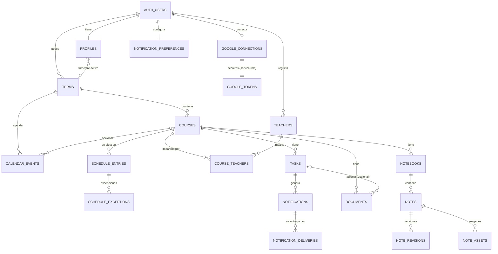

# Plan Maestro de Implementación — Órbita (Plataforma de Gestión Académica)

> Versión 1.0 · 2026-09-25 · Estado: **aprobado**
> Proyecto greenfield: `D:\sena_ws\orbita` está vacío (sin repositorio git aún).

## Contexto

Se quiere construir una aplicación web multiusuario, segura y responsive para que cada estudiante organice sus estudios con la jerarquía **Usuario → Trimestres → Clases → Tareas / Cuadernos / Documentos / Docente**, con horario semanal, dashboard diario, calendario, recordatorios, Google Drive y búsqueda. Este documento es el plan técnico y funcional completo (las 40 secciones pedidas) para implementar el sistema **fase por fase sin rediseñar la arquitectura**. No se escribe código hasta aprobar este plan; tras la aprobación se empieza por la Fase 0.

### Convenciones del documento
- **[MVP]** = entra en el primer MVP · **[MVP2]** / **[MVP3]** = post-MVP planificado · **[Futuro]** = versión avanzada.
- **Decisión por defecto** = opción propuesta cuando falta información; se puede cambiar antes de la fase correspondiente (listado completo en §39).
- Nombres técnicos en inglés (código, tablas); interfaz en español.

### Decisiones de nomenclatura (importante)
| Concepto UI | Nombre técnico | Motivo |
|---|---|---|
| Trimestre | `terms` | Neutral: sirve para trimestre, semestre o cuatrimestre sin renombrar tablas si el usuario cambia de sistema académico. |
| Clase / materia | `courses` | `class` es palabra reservada en JS/TS (no se puede usar como variable) y ambiguo en CSS/HTML. |
| Nota (apunte) | `notes` | "Notas" = apuntes dentro de un cuaderno. **Las calificaciones no están en el alcance** (ver §39). |

---

## 1. Resumen ejecutivo del producto

Órbita es un espacio académico personal y privado. El **trimestre** es el eje: todo (clases, horario, tareas, calendario, cuadernos, documentos) pertenece a un trimestre, y el usuario trabaja siempre dentro de un **trimestre activo** que puede cambiar en cualquier momento. Los trimestres pasados se conservan y se archivan (solo lectura), nunca se borran por defecto.

La pantalla principal ("Hoy") responde tres preguntas en menos de un segundo: **¿qué clases tengo hoy?, ¿qué tengo que entregar pronto?, ¿cómo entro rápido a una clase?**

Stack recomendado: **Next.js (App Router) + React + TypeScript + Tailwind CSS + shadcn/ui** en Vercel, sobre **Supabase** (PostgreSQL con Row Level Security, Auth, Storage, pg_cron, Edge Functions). Integraciones: Google Drive (OAuth propio, scope mínimo `drive.file` + Google Picker) y Resend para email.

Entregas: **MVP** (Fases 0–6: cuentas, trimestres, clases, docentes, horario, dashboard, tareas) → **MVP2** (calendario, cuadernos con editor enriquecido, documentos, mejoras UX) → **MVP3** (Google Drive, recordatorios, búsqueda) → **Versión avanzada** (PWA, Google Calendar, IA de estudio).

---

## 2. Requisitos funcionales

| ID | Módulo | Requisito | Alcance |
|---|---|---|---|
| RF-01 | Auth | Registro, login, logout, recuperación y cambio de contraseña, confirmación de email | MVP |
| RF-02 | Perfil | Ver/editar nombre, email (con reconfirmación), zona horaria, inicio de semana, tema | MVP |
| RF-03 | Trimestres | Crear, listar, ver, editar, finalizar, archivar, desarchivar; eliminar (acción excepcional con doble confirmación) | MVP |
| RF-04 | Trimestres | Seleccionar trimestre activo; toda la UI se filtra por él; trimestres pasados consultables | MVP |
| RF-05 | Clases | CRUD de clases dentro de un trimestre (nombre, código, descripción, color, aula, créditos) | MVP |
| RF-06 | Docente | Datos del docente por clase (nombre, email `mailto:`, teléfono `tel:`, oficina, horario de atención, info adicional); reutilizable entre clases | MVP |
| RF-07 | Horario | Entradas de horario (clase, día, hora inicio/fin, aula, notas); una clase varias veces por semana; vista semanal | MVP |
| RF-08 | Horario | Excepciones (cancelación, cambio de hora/aula en una fecha concreta) | MVP2 (esquema preparado) |
| RF-09 | Dashboard | Trimestre activo + selector, clases de hoy según horario y zona horaria, acceso rápido a clase, tareas próximas con prioridad visual por cercanía | MVP |
| RF-10 | Tareas | CRUD, completar/reabrir, cambiar fecha/prioridad, notas; fecha de vencimiento opcional; clasificación automática (vencida, hoy, mañana, esta semana, futura, completada, sin fecha); completadas consultables | MVP |
| RF-11 | Calendario | Vistas día/semana/mes con clases (ocurrencias del horario), tareas y eventos académicos; filtro por clase; sincronizado con tareas | MVP2 |
| RF-12 | Eventos | Eventos académicos (examen, festivo, evento) del trimestre, opcionalmente ligados a una clase | MVP2 |
| RF-13 | Cuadernos | Varios cuadernos por clase; varias notas por cuaderno | MVP2 |
| RF-14 | Editor | Texto, H1–H3, negrita, cursiva, listas, numeradas, checklists, tablas, enlaces, imágenes, código, separadores; autosave confiable, "última modificación" visible, recuperación (borrador local + revisiones) | MVP2 |
| RF-15 | Documentos | Subir, ver info, descargar (URL firmada), eliminar; asociar a clase y opcionalmente a tarea | MVP2 |
| RF-16 | Google Drive | Conectar cuenta, elegir archivos (Picker), asociarlos a clase/tarea como referencias, ver estado de conexión, desconectar | MVP3 |
| RF-17 | Recordatorios | Preferencias (7d, 3d, 1d, mismo día, 1h antes) globales y por tarea; notificaciones in-app sin duplicados; email | MVP3 |
| RF-18 | Búsqueda | Búsqueda global sobre clases, tareas, cuadernos, notas y documentos, respetando permisos | MVP3 |
| RF-19 | UX | Modo claro/oscuro, responsive, estados de carga/vacíos/error, confirmación de acciones destructivas | MVP (transversal) |
| RF-20 | Avanzado | PWA, sincronización con Google Calendar, IA (resúmenes, flashcards, cuestionarios, planes de estudio, progreso) | Futuro |

---

## 3. Requisitos no funcionales

| Categoría | Requisito | Meta / cómo se mide |
|---|---|---|
| Seguridad | Aislamiento total por usuario aplicado en BD (RLS) + servidor | Tests pgTAP y E2E de acceso cruzado A→B = 0 fugas |
| Rendimiento | Dashboard rápido | LCP < 2,5 s en 4G; consultas principales < 100 ms p95 con índices |
| Disponibilidad | Servicios gestionados | Objetivo 99,5 % (depende de Vercel/Supabase) |
| Accesibilidad | WCAG 2.1 AA | Contraste, foco visible, teclado completo, roles ARIA (Radix), axe en CI |
| Responsive | Móvil ≥ 360 px, tablet, desktop | Playwright en 3 viewports |
| Integridad | Datos consistentes | FKs compuestas, CHECKs, transacciones; sin datos huérfanos |
| Durabilidad | Backups | Backups diarios (Supabase Pro) + PITR opcional; restauración probada |
| Privacidad | Datos personales | Minimización, borrado de cuenta, cumplimiento Ley 1581/2012 (Colombia) y buenas prácticas GDPR |
| Mantenibilidad | Código por dominio | Módulos `features/*`, TS estricto, lint, ADRs, cobertura ≥ 80 % en lógica de dominio |
| Observabilidad | Errores y logs | Sentry (front + server), logs estructurados, alertas de jobs fallidos |
| Internacionalización | Español primero | Textos centralizados por módulo; sin librería i18n en MVP (ver §39) |
| Fechas | Correctas en cualquier zona horaria y con DST | Tests unitarios con zonas con DST (Madrid, Nueva York) y sin DST (Bogotá) |

---

## 4. Arquitectura propuesta

**Monolito modular** (una app Next.js) + **BaaS** (Supabase). Sin microservicios: innecesarios para el tamaño del producto.

```
┌──────────────────────── Navegador (desktop / móvil) ────────────────────────┐
│  React Server Components (lectura)  ·  Client Components (interacción)      │
│  Server Actions (mutaciones)  ·  TanStack Query (calendario, búsqueda, notif)│
└───────────────┬──────────────────────────────────────────────┬──────────────┘
                │ cookies de sesión (httpOnly, @supabase/ssr)   │ subida directa
                ▼                                               │ (URL firmada)
┌──────────────── Next.js en Vercel ────────────────┐           │
│ middleware/proxy: refresco de sesión, rutas protegidas         │
│ Server Actions ─┐                                 │           │
│ Route Handlers ─┼─► features/*/service.ts ─► supabase-js (JWT del usuario → RLS)
│  /api/v1/*      │   (validación Zod, reglas)      │           │
│  /api/integrations/google/* (OAuth, tokens cifrados, service role acotado)
│  /api/cron/*  (protegido por secreto)             │           │
└───────────┬───────────────────────────┬───────────┘           │
            ▼                           ▼                       ▼
┌──────────── Supabase ─────────────────────────────────────────────────────┐
│ PostgreSQL + RLS · Auth · Storage (buckets privados) · pg_cron · pg_net     │
│ Edge Functions (envío de emails/push) · FTS (tsvector, unaccent, pg_trgm)   │
└────────────────────────────────────────────────────────────────────────────┘
            │                                   │
            ▼                                   ▼
     Google OAuth / Drive / Picker          Resend (email)      Sentry (errores)
```

Principios:
1. **La base de datos es la última línea de defensa**: RLS + FKs compuestas garantizan pertenencia aunque falle el código.
2. **Una sola capa de dominio** (`service.ts` por módulo) usada por Server Actions (web) y Route Handlers `/api/v1` (futura app móvil/PWA/integraciones). No se duplica lógica.
3. **Las consultas del usuario usan siempre su JWT** (cliente Supabase de servidor con cookies) → RLS se aplica. El `service_role` solo se usa en módulos acotados (tokens de Google, cron, purgas) y nunca llega al navegador.
4. **Fechas**: instantes en `timestamptz`, fechas civiles en `date`, horarios recurrentes como hora local + zona del trimestre (ver §27).

---

## 5. Stack tecnológico recomendado y justificación

| Capa | Elección | Alternativas evaluadas | Por qué |
|---|---|---|---|
| Framework web | **Next.js (App Router, versión estable actual) + React + TypeScript estricto** | Remix/React Router 7, SvelteKit, SPA Vite + API | SSR/RSC para dashboard rápido, Server Actions, Route Handlers para OAuth/cron, ecosistema y despliegue en Vercel. Cumple todo lo pedido. |
| Estilos / UI | **Tailwind CSS + shadcn/ui (Radix)** + lucide-react | MUI, Chakra, Mantine | Componentes accesibles (Radix) copiados al repo (sin lock-in), modo oscuro con variables CSS, diseño limpio. |
| Formularios / validación | **React Hook Form + Zod** (esquemas compartidos cliente/servidor) | Valibot, Yup | Zod en servidor es la validación de verdad; el cliente reutiliza los mismos esquemas para UX. |
| Datos cliente | **RSC + Server Actions**; **TanStack Query** solo en islas interactivas (calendario, búsqueda, notificaciones) | SWR, Redux | Evita estado global innecesario; caché cliente solo donde hay rangos/interacción. |
| Base de datos | **Supabase PostgreSQL** | Firebase/Firestore, Neon + backend propio, PlanetScale | El dominio es relacional (jerarquías, FKs, restricciones). RLS nativo resuelve el aislamiento en BD. Firestore encaja mal con relaciones e integridad. |
| Acceso a datos | **supabase-js + tipos generados (`supabase gen types`)**; migraciones SQL con Supabase CLI | Prisma / Drizzle | Un ORM conecta como rol privilegiado y **se salta RLS** salvo configuración delicada; supabase-js con el JWT del usuario aplica RLS automáticamente. SQL puro permite políticas, triggers y funciones. |
| Auth | **Supabase Auth** (email+contraseña, PKCE, cookies con `@supabase/ssr`) | Auth.js, Clerk | Integrado con RLS (`auth.uid()`), recuperación de contraseña, confirmación de email, rate limits incluidos. |
| Archivos | **Supabase Storage** (buckets privados, políticas por carpeta, URLs firmadas) | S3/R2 directo | Almacenamiento de objetos con políticas RLS y URLs firmadas nativas; S3-compatible si se migra. |
| Editor | **Tiptap** (ProseMirror), contenido en JSON | Lexical, BlockNote, Plate | Cubre todos los formatos pedidos con extensiones oficiales (tablas, tareas, imágenes, código); JSON versionable; open source. |
| Calendario | **FullCalendar** (plugins MIT: daygrid, timegrid, list, interaction; locale `es`) | Schedule-X, construir propio | Día/semana/mes listos, accesible, drag & drop futuro. Carga diferida para no penalizar el bundle. |
| Fechas | **date-fns v4 + @date-fns/tz** | Luxon, Day.js, Temporal (polyfill) | Tree-shakeable, soporte de zonas IANA con `TZDate`; Temporal se reevaluará cuando esté estable en todos los runtimes. |
| Jobs programados | **pg_cron** (+ pg_net → Edge Function para envíos) | Vercel Cron, Inngest, colas externas | Dentro de la BD, idempotente con SQL; sin infraestructura extra. |
| Email | **Resend** (+ SMTP personalizado para emails de Supabase Auth) | SendGrid, SES | Simple, buena entregabilidad, plantillas React Email. |
| Búsqueda | **PostgreSQL FTS** (`tsvector` español + `unaccent`) + `pg_trgm` | Algolia, Meilisearch, Typesense | Suficiente para el volumen por usuario, respeta RLS sin sincronizar índices externos. |
| Rate limiting | **Upstash Redis + @upstash/ratelimit** (serverless) + límites de Supabase Auth | Tabla Postgres, middleware propio | Contadores con TTL sin cargar la BD. |
| Observabilidad | **Sentry**, Vercel Analytics | LogRocket, Datadog | Errores con contexto en cliente y servidor. |
| Testing | **Vitest**, **Testing Library**, **pgTAP** (políticas RLS), **Playwright** (E2E) | Jest, Cypress | Rápido; pgTAP prueba seguridad en la propia BD. |
| Hosting | **Vercel** + **Supabase Cloud** (misma región, p. ej. `us-east-1`) | Docker en Railway/Fly/VPS | Cero ops; previews por PR. Salida posible: Supabase es Postgres estándar y Next.js es autoalojable. |

**Conclusión del análisis**: la preferencia inicial (Next.js + Supabase) es adecuada. Huecos que Supabase no cubre y cómo se resuelven: tokens de Google (tabla cifrada + service role acotado), envío de email (Resend), rate limiting de endpoints propios (Upstash), expansión de horarios recurrentes (lógica propia en TS, pura y testeada).

---

## 6. Arquitectura frontend

- **Rutas por grupos**: `(auth)` público, `(app)` protegido (layout con shell), `onboarding`.
- **Server Components por defecto**: páginas leen datos en servidor con el cliente Supabase del usuario (RLS). `React.cache()` para deduplicar por petición. **No se cachean datos privados entre usuarios** (páginas dinámicas).
- **Mutaciones**: Server Actions que devuelven `Result<T>` (§28); `revalidatePath`/`revalidateTag` tras mutar; `useOptimistic` para completar tareas al instante.
- **Islas cliente**: calendario, editor, subida de archivos, búsqueda/Command palette, campana de notificaciones → TanStack Query con claves `['calendar', termId, range, filters]`, etc.
- **Estado de UI**: filtros y vistas en **query params** (compartibles, botón atrás funciona); tema en cookie (`next-themes`); sin store global.
- **Formularios**: RHF + Zod; errores de campo desde el servidor mapeados al formulario.
- **Diseño**: tokens CSS (claro/oscuro), **paleta fija de 12 colores de clase** con variantes accesibles en ambos temas (se guarda el token, no el hex).
- **Carga diferida**: Tiptap, FullCalendar y Google Picker con `next/dynamic`.
- **Accesibilidad**: componentes Radix, foco gestionado en diálogos, `aria-live` para "Guardado", atajos de teclado documentados.
- **Estados**: cada vista define `loading.tsx` (skeletons), estado vacío (§24), `error.tsx` y `not-found.tsx`.

---

## 7. Arquitectura backend

- **Capa de dominio** `src/features/<modulo>/service.ts`: funciones puras respecto al transporte, reciben el cliente Supabase y un DTO ya validado; aplican reglas de negocio (p. ej. trimestre archivado = solo lectura, avisos de solapamiento).
- **Transportes**:
  - `actions.ts` (Server Actions) para la web. Cada acción: `requireUser()` → `schema.parse()` → `service` → `Result`.
  - `src/app/api/v1/**/route.ts` para API REST (misma lógica) — se construye incrementalmente; imprescindible para OAuth, descargas, cron y futura app móvil.
- **Base de datos como motor de reglas**: FKs compuestas, CHECKs, triggers (`updated_at`, cálculo de `due_at`, solo-lectura de trimestres archivados, `completed_at`), funciones RPC `SECURITY INVOKER` para consultas agregadas (hoy, próximas, búsqueda, calendario).
- **Clientes Supabase** (`src/lib/supabase/`): `server.ts` (JWT usuario, cookies), `client.ts` (navegador, solo lecturas puntuales/realtime), `admin.ts` (service role; importable solo desde módulos `server-only` autorizados: google, cron, purgas).
- **Jobs**: pg_cron → funciones SQL idempotentes (recordatorios, purga de papelera, limpieza de subidas huérfanas) y pg_net → Edge Function para envíos externos.
- **Secretos**: validados al arrancar con Zod en `src/lib/env.ts`; `server-only` para impedir importación en cliente.

---

## 8. Arquitectura de base de datos

### Reglas globales
- PK `uuid` (`gen_random_uuid()`); todas las tablas de dominio tienen **`user_id`** (desnormalizado a propósito) con `DEFAULT auth.uid()` → políticas RLS simples y rápidas.
- **FKs compuestas de propiedad**: cada padre expone `UNIQUE (id, user_id)` y el hijo referencia `(parent_id, user_id)`. Así **es imposible** (a nivel de BD) crear una clase en un trimestre ajeno, una tarea en una clase ajena, etc., aunque se manipulen IDs.
- `created_at`, `updated_at` (`timestamptz`, trigger `set_updated_at`) en todas las tablas mutables.
- Enums de Postgres para estados (ampliables con `ALTER TYPE ... ADD VALUE`).
- Soft delete (`deleted_at`) solo donde aporta recuperación (§26); índices parciales `WHERE deleted_at IS NULL`.
- Borrado de usuario → `ON DELETE CASCADE` desde `auth.users` en todo su árbol + purga de Storage por job.

### Tablas

**`profiles`** — datos de cuenta/preferencias (1:1 con `auth.users`, creado por trigger al registrarse).
| Columna | Tipo | Notas |
|---|---|---|
| id | uuid PK, FK → auth.users ON DELETE CASCADE | |
| full_name | text NOT NULL, 1–100 | |
| timezone | text NOT NULL | IANA; detectada en el navegador al registrarse, fallback `America/Bogota`; validada contra `pg_timezone_names` |
| week_starts_on | smallint DEFAULT 1 | 1=lunes … 7=domingo |
| theme | text DEFAULT 'system' | 'light' \| 'dark' \| 'system' |
| active_term_id | uuid NULL | FK compuesta `(active_term_id, id) → terms(id, user_id)` ON DELETE SET NULL (columna) |
| onboarded_at | timestamptz NULL | |
| timestamps | | |

**`terms`** (trimestres)
| Columna | Tipo | Notas |
|---|---|---|
| id, user_id | uuid | `UNIQUE (id, user_id)` |
| name | text NOT NULL 1–80 | "Segundo trimestre" |
| year | smallint NOT NULL | CHECK 2000–2100 |
| start_date, end_date | date NOT NULL | CHECK `end_date >= start_date` |
| timezone | text NOT NULL | zona de la institución (por defecto la del perfil); el horario se interpreta en ella |
| status | enum `term_status` ('active','finished','archived') DEFAULT 'active' | ciclo de vida |
| description | text NULL ≤ 1000 | |
| finished_at, archived_at | timestamptz NULL | |
| timestamps | | |
Índices: `(user_id, status, start_date DESC)`. Trigger: si `status='archived'`, los hijos pasan a solo lectura (ver §12).

**`courses`** (clases)
| Columna | Tipo | Notas |
|---|---|---|
| id, user_id, term_id | uuid | FK `(term_id, user_id) → terms(id, user_id)` ON DELETE CASCADE; `UNIQUE (id, user_id)`, `UNIQUE (id, term_id, user_id)` |
| name | text NOT NULL 1–100 | |
| code | text NULL ≤ 30 | "MAT-204" |
| description | text NULL ≤ 2000 | |
| color | text NOT NULL | token de la paleta (CHECK en lista) |
| icon | text NULL | emoji opcional (📐) usado en dashboard |
| room | text NULL ≤ 50 | aula por defecto |
| credits | numeric(4,1) NULL | CHECK ≥ 0 |
| position | int | orden manual |
| deleted_at | timestamptz NULL | soft delete |
Índices: `(term_id, position) WHERE deleted_at IS NULL`.

**`teachers`** — docentes del usuario (reutilizables entre clases y trimestres).
id, user_id (`UNIQUE (id,user_id)`), full_name NOT NULL, email (formato), phone, office, office_hours (texto libre en MVP), notes, timestamps. Índice `(user_id, lower(full_name))`.

**`course_teachers`** — relación N:M (una clase puede tener titular + auxiliar de laboratorio; un docente puede dar varias clases).
course_id, teacher_id, user_id, role text NULL ('titular','auxiliar','monitor'…), is_primary bool; PK `(course_id, teacher_id)`; FKs compuestas con `user_id`; índice único parcial `(course_id) WHERE is_primary`. **En el MVP la UI gestiona un docente principal**; el esquema ya soporta varios sin migración.

**`schedule_entries`** — bloques semanales recurrentes.
| Columna | Tipo | Notas |
|---|---|---|
| id, user_id, term_id, course_id | uuid | FK `(course_id, term_id, user_id) → courses(id, term_id, user_id)` ON DELETE CASCADE (garantiza que la clase es del mismo trimestre) |
| weekday | smallint | ISO 1–7 (CHECK) |
| start_time, end_time | time | CHECK `end_time > start_time` (no cruza medianoche) |
| room | text NULL | sobrescribe el aula de la clase |
| notes | text NULL | |
| valid_from, valid_until | date NULL | vigencia parcial dentro del trimestre (horarios distintos por periodo) |
Índices: `(term_id, weekday, start_time)`, `(course_id)`.

**`schedule_exceptions`** [MVP2, tabla creada en Fase 4 para no rediseñar] — excepciones por fecha.
id, user_id, schedule_entry_id (FK compuesta), date, kind enum ('cancelled','rescheduled','room_change','extra'), new_start_time, new_end_time, new_room, notes; `UNIQUE (schedule_entry_id, date)` (salvo 'extra', que usa `schedule_entry_id` NULL + course_id). Cubre clases especiales, cambios de aula y excepciones.

**`tasks`**
| Columna | Tipo | Notas |
|---|---|---|
| id, user_id, term_id, course_id | uuid | FK `(course_id, term_id, user_id) → courses(...)` ON DELETE CASCADE; `UNIQUE (id, course_id, user_id)` |
| title | text NOT NULL 1–200 | |
| description | text NULL ≤ 5000 | |
| notes | text NULL ≤ 10000 | |
| status | enum `task_status` ('pending','completed') | ampliable: 'in_progress','cancelled','rescheduled' |
| priority | enum `task_priority` ('low','normal','high','urgent') DEFAULT 'normal' | |
| due_date | date NULL | fecha civil |
| due_time | time NULL | CHECK `due_time IS NULL OR due_date IS NOT NULL` |
| due_tz | text NULL | zona usada para interpretar (snapshot de la zona del trimestre) |
| due_at | timestamptz NULL | **calculado por trigger**: `(due_date + coalesce(due_time,'23:59:59')) AT TIME ZONE due_tz` — ordena y dispara recordatorios |
| reminder_offsets | int[] NULL | minutos antes; NULL = usar preferencias globales |
| completed_at | timestamptz NULL | CHECK `(status='completed') = (completed_at IS NOT NULL)` (trigger lo fija) |
| deleted_at | timestamptz NULL | |
Índices: `(user_id, status, due_at) WHERE deleted_at IS NULL`, `(course_id, status)`, `(term_id, due_at)`.

**`calendar_events`** [MVP2] — eventos académicos que no son tareas ni clases (exámenes finales institucionales, festivos, semana de receso).
id, user_id, term_id, course_id NULL (FK compuesta si no es NULL), title, description, kind enum ('exam','holiday','event','other'), all_day bool, start_at/end_at timestamptz (con hora) o start_date/end_date date (todo el día) — CHECK de coherencia, location, timestamps. Índice `(term_id, start_at)`.
> **Decisión**: el calendario **no duplica** tareas ni clases en `calendar_events`; las agrega en lectura. Así, cambiar la fecha de una tarea actualiza el calendario automáticamente sin sincronización.

**`notebooks`** [MVP2] — id, user_id, course_id (FK compuesta), title 1–100, description, position, deleted_at, timestamps.

**`notes`** [MVP2]
| Columna | Tipo | Notas |
|---|---|---|
| id, user_id, notebook_id | uuid | FK compuesta |
| title | text NOT NULL | |
| content | jsonb NOT NULL | documento Tiptap/ProseMirror; `schema_version` dentro |
| content_text | text | texto plano derivado (búsqueda, vista previa) |
| version | int NOT NULL DEFAULT 1 | concurrencia optimista del autosave |
| last_edited_at | timestamptz | visible como "Última modificación" |
| deleted_at, timestamps | | |
| search | tsvector GENERATED | título (peso A) + content_text (peso B) |
Límite de tamaño del contenido (p. ej. 1 MB JSON) validado en servidor.

**`note_revisions`** [MVP2] — snapshots para recuperación: id, user_id, note_id, version, content jsonb, created_at. Se crea como máximo cada 10 min de edición o al cerrar sesión de edición; se conservan las últimas 50 por nota.

**`note_assets`** [MVP2] — imágenes del editor: id, user_id, note_id, storage_path, mime, size_bytes, created_at (permite limpieza de huérfanas y cuota).

**`documents`** [MVP2 upload, MVP3 Drive]
| Columna | Tipo | Notas |
|---|---|---|
| id, user_id, course_id | uuid | FK compuesta |
| task_id | uuid NULL | FK `(task_id, course_id, user_id) → tasks(id, course_id, user_id)` ON DELETE SET NULL(task_id) — la tarea debe ser de la misma clase |
| source | enum ('upload','google_drive') | |
| name | text NOT NULL ≤ 255 | nombre mostrado |
| mime_type, size_bytes | text, bigint | |
| storage_path | text NULL | `{user_id}/{course_id}/{document_id}/{archivo-saneado}`; requerido si upload |
| upload_status | enum ('pending','ready') | subida en dos pasos |
| checksum_sha256 | text NULL | |
| drive_file_id, drive_web_view_link, drive_icon_link | text NULL | requeridos si google_drive |
| remote_status | enum ('ok','unavailable','disconnected') NULL | estado de la referencia Drive |
| deleted_at, timestamps | | |
CHECKs por `source`; `UNIQUE (course_id, drive_file_id) WHERE source='google_drive' AND deleted_at IS NULL`; índice `(course_id, created_at DESC)`, `(task_id)`.

**`google_connections`** [MVP3] — estado visible para el usuario (sin secretos): id, user_id UNIQUE, google_sub, google_email, scopes text[], status enum ('active','needs_reauth','revoked','error'), last_error, connected_at, last_used_at, revoked_at, timestamps. RLS: el usuario solo puede **leer** su fila.

**`google_tokens`** [MVP3] — secretos: connection_id PK/FK ON DELETE CASCADE, refresh_token_ciphertext bytea, access_token_ciphertext bytea, access_token_expires_at, key_version smallint. **RLS activado sin políticas** para `authenticated`/`anon` → solo accesible con service role desde el servidor.

**`notification_preferences`** [MVP3] — user_id PK, default_offsets int[] DEFAULT '{1440}' (valores permitidos: 10080, 4320, 1440, 'mismo día', 60), same_day_time time DEFAULT '08:00', in_app bool, email bool, push bool (futuro), timestamps. "Mismo día" se modela como offset especial `-1` = disparar a `same_day_time` local del día de vencimiento.

**`notifications`** [MVP3] — id, user_id, type enum ('task_reminder', … ampliable), task_id NULL (FK compuesta ON DELETE CASCADE), title, body, link, **dedupe_key text UNIQUE** (p. ej. `task:{id}:off:{offset}:due:{epoch_due_at}`), scheduled_for timestamptz, created_at, read_at. Índice `(user_id, read_at, created_at DESC)`.

**`notification_deliveries`** [MVP3] — id, notification_id, channel enum ('in_app','email','push'), status enum ('pending','sent','failed','cancelled'), attempts, last_error, sent_at; `UNIQUE (notification_id, channel)` → sin duplicados por canal.

**`push_subscriptions`** [Futuro] — endpoint, keys, user_agent (Web Push).

### Análisis de combinaciones/divisiones respecto a la lista inicial
- `users` → no se crea: se usa `auth.users` de Supabase + `profiles`.
- `teachers` → dividida en `teachers` + `course_teachers` (reutilización y múltiples docentes).
- `schedule_entries` → se añade `schedule_exceptions` para excepciones sin romper la recurrencia.
- `notes` → se añaden `note_revisions` (recuperación) y `note_assets` (imágenes).
- `google_connections` → dividida en estado visible + `google_tokens` inaccesible desde el cliente.
- `notifications` → se añaden `notification_preferences` y `notification_deliveries` (multi-canal, idempotencia).
- `calendar_events` → solo eventos propios; tareas y clases se agregan, no se copian.

---

## 9. Diagrama de relaciones (ER conceptual)



Jerarquía de propiedad (todas llevan `user_id`): `user → term → course → {schedule_entry → exception, task, notebook → note → revision/asset, document, course_teacher}`; `user → teacher`; `user → google_connection → google_tokens`; `user → notification → delivery`.

---

## 10. Modelo de seguridad

Defensa en profundidad, en este orden:
1. **Autenticación** (Supabase Auth, cookies httpOnly + Secure + SameSite=Lax, PKCE).
2. **Protección de rutas** en middleware/proxy (redirige a `/login`) — solo UX; **no es la barrera real**.
3. **Autorización en servidor**: cada Server Action / Route Handler llama `requireUser()`; nunca acepta `user_id` desde el cliente.
4. **Validación** Zod en servidor de todos los inputs (tipos, longitudes, enums, fechas, UUIDs).
5. **RLS en todas las tablas** (`user_id = (select auth.uid())`) + **FKs compuestas** que impiden enlazar recursos de otro usuario.
6. **Storage privado** con políticas por carpeta `{user_id}/…` y URLs firmadas de vida corta.
7. **Secretos** solo en servidor; tokens OAuth cifrados; service role aislado en módulos `server-only`.
8. **Rate limiting** en endpoints sensibles; límites de Auth de Supabase; CAPTCHA (Cloudflare Turnstile) en registro/recuperación si hay abuso.
9. **Cabeceras**: CSP estricta (scripts propios + Google Picker), `X-Frame-Options: DENY`, `Referrer-Policy`, HSTS.
10. **Sanitización**: React escapa por defecto; el contenido del editor se renderiza solo mediante el esquema Tiptap (sin HTML crudo); enlaces restringidos a `http(s)`/`mailto`/`tel`; nombres de archivo saneados; `Content-Disposition: attachment` en descargas.

Principio de **no revelar existencia**: un recurso ajeno responde **404**, no 403.

---

## 11. Sistema de autenticación

| Flujo | Implementación |
|---|---|
| Registro | email, contraseña (mín. 8, verificación de contraseñas filtradas — Supabase Pro), nombre; zona horaria detectada con `Intl`. Email de confirmación (SMTP propio vía Resend). Trigger `on_auth_user_created` crea `profiles`. Respuesta genérica para no enumerar emails. |
| Login | `signInWithPassword`; sesión en cookies (`@supabase/ssr`); redirección a `/hoy` o a onboarding si no hay trimestres. |
| Logout | `signOut` (scope local) + limpieza de caché cliente. |
| Recuperación | `resetPasswordForEmail` → enlace → `/auth/callback` (intercambio PKCE) → `/restablecer` → `updateUser({password})`. Siempre "si el correo existe, te enviamos un enlace". |
| Cambio de contraseña | en Configuración; reautenticación con contraseña actual (reauthenticate/nonce). |
| Cambio de email | confirmación en ambos correos (flujo seguro de Supabase). |
| Sesiones | refresco en middleware; expiración configurable; cerrar sesión en todos los dispositivos (scope global). |
| Borrado de cuenta | [Fase 13, recomendado] confirmación + reautenticación → función servidor elimina `auth.users` (cascada) y purga Storage. |
| Login con Google | [Futuro/opcional] **separado** de la conexión con Drive (distintos propósitos y scopes). |

---

## 12. Sistema de trimestres

- **Estado (`status`) ≠ trimestre activo.** `status` describe el ciclo de vida (`active` en curso, `finished` terminado, `archived` guardado/solo lectura). El **trimestre activo** es la selección del usuario (`profiles.active_term_id`) que define el contexto de toda la UI.
- Transiciones: `active → finished → archived`, `archived → finished` (desarchivar). Finalizar sugiere archivar; nunca se elimina automáticamente.
- **Solo lectura al archivar**: trigger `assert_term_writable()` en tablas hijas bloquea INSERT/UPDATE/DELETE si el trimestre está `archived` (error `TERM_ARCHIVED`). Excepción: desarchivar.
- Cambiar trimestre activo: `PUT /me/active-term`; se permite seleccionar cualquiera (incluso archivado, en modo lectura con banner).
- Al crear el primer trimestre se marca como activo automáticamente. Al archivar el trimestre activo se sugiere elegir otro.
- Solapamiento de fechas entre trimestres: **permitido** (cursos intersemestrales, doble programa) con aviso.
- Eliminación física: solo desde Configuración del trimestre, escribiendo su nombre; borra en cascada (incluidos archivos vía job).
- Si la fecha actual está fuera del rango del trimestre activo, el dashboard lo indica ("Este trimestre terminó el 12 dic.") y ofrece cambiar.

---

## 13. Sistema de clases

- Una clase pertenece obligatoriamente a un trimestre (FK compuesta NOT NULL).
- Espacio virtual por clase: `/clases/[courseId]` con pestañas **Resumen · Tareas · Cuadernos · Documentos · Horario · Profesor**.
- **Resumen**: próximas sesiones (del horario), tareas pendientes, últimos cuadernos/documentos, docente principal con acciones rápidas.
- Color de paleta fija (12 tokens accesibles claro/oscuro) + emoji opcional.
- Orden manual (`position`) con arrastrar en la lista de clases.
- Borrado: soft delete con confirmación que muestra el impacto ("se ocultarán 12 tareas, 3 cuadernos…"); restauración desde Papelera (MVP2); purga definitiva a los 30 días.
- "Copiar clases de otro trimestre" → **[Post-MVP, opcional]**: no pedido explícitamente; se deja anotado como mejora UX, no se implementa sin aprobación.
- **Docente**: tarjeta en Resumen y pestaña Profesor; `mailto:` y `tel:` clicables; buscador para reutilizar un docente existente o crear uno nuevo.

---

## 14. Sistema de horarios

- Entidad independiente `schedule_entries` (no booleanos en la clase). Una clase puede tener N entradas.
- Validaciones: día 1–7; `end_time > start_time`; clase del mismo trimestre (FK); vigencia dentro del rango del trimestre; duración ≤ 12 h.
- **Solapamientos**: se permiten pero se **avisa** (respuesta con `warnings`), porque existen casos reales (clase y laboratorio superpuestos por error institucional).
- **Interpretación temporal**: horas "de pared" en la zona del trimestre (`terms.timezone`). Una ocurrencia concreta = (fecha local + hora local) → instante UTC calculado al expandir; así los cambios de horario de verano se respetan.
- **Expansión** (`lib/schedule/expand.ts`, función pura): dado un rango de fechas, genera ocurrencias por día de la semana dentro de `[max(term.start, valid_from, desde), min(term.end, valid_until, hasta)]`, aplica `schedule_exceptions` (cancelar, mover, cambiar aula, extra) y devuelve ocurrencias ordenadas. Usada por dashboard (hoy), calendario y futuros recordatorios de clase.
- **UI**: rejilla semanal (lun–dom, rango horario adaptable 6:00–22:00), crear con clic en hueco o formulario; en móvil lista agrupada por día.
- Preparado para el futuro: horarios distintos por periodo (`valid_from/until`), excepciones, clases especiales (`kind='extra'`), cambios de aula.

---

## 15. Sistema de tareas

- Pertenencia: tarea → clase → trimestre → usuario (FKs compuestas; `term_id` desnormalizado para consultas rápidas y garantizado consistente).
- Acciones: crear (desde clase, dashboard o "Tareas" con selector de clase), editar, eliminar (soft delete + "Deshacer" en toast), completar / reabrir (fija/limpia `completed_at`), cambiar fecha/prioridad, notas.
- **Fecha opcional** (decisión por defecto): sin fecha → grupo "Sin fecha"; sin hora → vence al final del día local.
- **Clasificación** `classifyTask(task, now, tz, weekStartsOn)` (pura, testeada) → `completed | overdue | today | tomorrow | this_week | future | no_date`. Se calcula en lectura (no se guarda) para no quedar desactualizada.
- **Prioridad visual** (dashboard): combina cercanía y prioridad — vencida/hoy = rojo, mañana = naranja, esta semana = amarillo, futura = neutro; prioridad `urgent/high` añade insignia. Siempre con icono + texto (no solo color).
- Listas: filtros por clase, estado, prioridad, rango; orden por `due_at NULLS LAST, priority`; paginación por cursor (keyset). Completadas en pestaña/filtro propio, nunca desaparecen.
- Extensibilidad: nuevos estados vía `ALTER TYPE`; la UI usa un mapa `statusMeta` central.

---

## 16. Sistema de calendario [MVP2]

- Fuente única de lectura: `GET /terms/:termId/calendar?from&to&course_ids` → `{ occurrences (horario expandido), tasks (por due_at), events }` normalizado a `CalendarItem { id, type, title, start, end, allDay, courseId, color, href }`.
- Vistas **día / semana / mes** (FullCalendar timeGrid/dayGrid; en móvil vista lista/agenda por defecto).
- Filtro por clase con checkboxes (persistido en query params); color de cada clase.
- **Sincronización**: como tareas no se copian, cualquier cambio de `due_date` invalida la clave `['calendar', termId]` y el calendario se refresca; en la misma pestaña, actualización optimista.
- Eventos académicos: CRUD sencillo desde el calendario.
- Clic en ítem → ir a la clase / abrir tarea en panel lateral.
- [Post-MVP2] arrastrar tarea para reprogramar.

---

## 17. Sistema de cuadernos [MVP2]

- Cuadernos por clase; notas por cuaderno; lista con "Última modificación hace 5 min".
- Editor Tiptap: StarterKit (títulos, negrita, cursiva, listas, código, separador), TaskList, Table, Link (validado), Image (subida a bucket `note-assets`), CodeBlockLowlight, Placeholder.
- **Autosave confiable**:
  1. Debounce 1,5 s + guardado al perder foco / `visibilitychange` / cerrar.
  2. `PATCH /notes/:id {content, base_version}` → si `base_version` coincide, guarda y devuelve `version+1`; si no, **409 CONFLICT** → la UI ofrece "mantener mía / ver versión del servidor" (evita pérdidas entre pestañas/dispositivos).
  3. **Borrador local en IndexedDB** antes de cada envío; se elimina al confirmar. Si falla la red o se cierra el navegador, al reabrir se ofrece recuperar.
  4. Indicador de estado: "Guardando… / Guardado / Sin conexión, guardado localmente / Error, reintentando" (`aria-live`).
  5. Reintentos con backoff exponencial.
  6. `note_revisions` para restaurar versiones previas.
- Servidor recalcula `content_text` desde el JSON (no confía en el cliente) para búsqueda.
- Imágenes: compresión en cliente (máx. 2560 px, WebP), límite 10 MB, se sirven con URL firmada.

---

## 18. Sistema de documentos [MVP2]

- Bucket privado `documents`; ruta `{user_id}/{course_id}/{document_id}/{nombre-saneado}`.
- **Subida en dos pasos** (no pasa el archivo por la función serverless):
  1. `POST /courses/:id/documents/upload-url {name, size, mime, task_id?}` → valida tamaño/tipo/cuota, crea fila `pending`, devuelve URL de subida firmada.
  2. Cliente sube directo a Storage (barra de progreso).
  3. `POST /documents/:id/finalize` → verifica que el objeto existe y coincide en tamaño/tipo → `ready`.
  4. Job diario elimina filas `pending` > 24 h y objetos huérfanos.
- Límites por defecto: **50 MB por archivo**, **1 GB por usuario** (configurables). Tipos permitidos: PDF, imágenes, Office/OpenDocument, texto, ZIP (lista blanca por MIME + extensión).
- Descarga/vista: `GET /documents/:id/download` → comprueba fila (RLS) → URL firmada de 60 s con `download` → redirección. Vista previa en línea de PDF/imagen.
- Asociación opcional a tarea de la misma clase (FK compuesta).
- Eliminar: soft delete → objeto se borra en la purga (30 días).
- Políticas Storage: `bucket_id='documents' AND (storage.foldername(name))[1] = auth.uid()::text` para select/insert/delete.

---

## 19. Integración con Google Drive [MVP3]

**Decisión clave de alcance**: scope **`drive.file`** + **Google Picker**. El usuario elige archivos en el Picker de Google y la app solo obtiene acceso a esos archivos. Es un scope no restringido → evita la auditoría de seguridad (CASA) que exigen `drive.readonly`/`drive`. Scopes: `openid email drive.file`.

Flujo:
1. `GET /api/integrations/google/connect` → genera `state` aleatorio + `code_verifier` PKCE en cookie httpOnly firmada de 10 min → redirige a Google (`access_type=offline`, `prompt=consent`, `include_granted_scopes=true`).
2. `GET /api/integrations/google/callback` → valida `state`, intercambia `code`, verifica `id_token`, guarda `google_connections` + `google_tokens` **cifrados con AES-256-GCM** (clave `GOOGLE_TOKEN_ENC_KEY` en env, `key_version` para rotación).
3. Picker: `GET /api/integrations/google/picker-token` devuelve un access token de corta vida (refrescado en servidor si expiró). El refresh token nunca sale del servidor.
4. Asociar: `POST /courses/:id/documents/drive {file_ids, task_id?}` → el servidor valida cada archivo con `files.get` (nombre, MIME, tamaño, `webViewLink`, `iconLink`) y crea `documents` con `source='google_drive'` (**referencia, no copia**).
5. Consultar: al abrir se usa `webViewLink`; metadatos se refrescan bajo demanda (con caché de 1 h).
6. Desconectar: `DELETE /api/integrations/google` → revoca en `oauth2.googleapis.com/revoke`, borra tokens, marca documentos Drive `remote_status='disconnected'` (se conservan como referencia y vuelven a funcionar al reconectar).

Manejo de errores: `invalid_grant` → `needs_reauth` + banner "Reconecta Google Drive"; 401 → refresco una vez y reintento; 403/404 del archivo → `remote_status='unavailable'`; 429/5xx → backoff. Estado de conexión visible en Configuración → Integraciones.

Requisitos externos: proyecto en Google Cloud, pantalla de consentimiento verificada (dominio propio, política de privacidad, términos) — **iniciar trámite en MVP2** porque tarda.

---

## 20. Sistema de notificaciones [MVP3]

- **Preferencias**: globales (`notification_preferences`) + por tarea (`tasks.reminder_offsets`). Opciones: 7 días, 3 días, 1 día, mismo día (a las 08:00 locales, configurable), 1 hora antes.
- **Generación** (pg_cron cada 5 min → `generate_task_reminders()` SQL, idempotente):
  - Para tareas `pending`, no borradas, con `due_at` en los próximos 8 días, calcula `trigger_at` por offset.
  - Inserta si `trigger_at <= now()` y `trigger_at >= greatest(task.created_at, now() - 30 min)` (no dispara recordatorios "atrasados" de tareas recién creadas ni en ráfaga tras una caída larga) y `now() < due_at`.
  - `INSERT … ON CONFLICT (dedupe_key) DO NOTHING` con `dedupe_key = task:{id}:off:{offset}:due:{epoch(due_at)}` → **sin duplicados**; si la fecha cambia, la clave cambia y se generan los recordatorios correctos; los pendientes de la fecha anterior se cancelan (`deliveries.status='cancelled'`).
  - Tarea completada/borrada → no genera más y cancela entregas pendientes.
- **Canales**: `in_app` (campana con contador; polling 60 s o Supabase Realtime), `email` (Edge Function vía pg_net procesa `deliveries` pendientes con Resend, reintentos, `attempts`), `push` [Futuro] (Web Push con `push_subscriptions`).
- Textos: "Tu tarea de Cálculo II vence mañana." / "El parcial de Física vence en 3 días." (plantillas por offset).
- Tabla de control: `notifications` + `notification_deliveries` registran qué se generó y se envió por canal.

---

## 21. Sistema de búsqueda [MVP3]

- Columnas `search tsvector` generadas en `courses` (nombre, código, descripción), `tasks` (título, descripción, notas), `notebooks` (título), `notes` (título + content_text), `documents` (nombre); configuración `spanish` con `unaccent` (envoltorio `immutable_unaccent`); índices GIN.
- `pg_trgm` en títulos para coincidencias parciales/errores de tipeo.
- RPC `search_all(q, term_id NULL, types[], limit)` **SECURITY INVOKER** → RLS aplica automáticamente; `UNION ALL` con `ts_rank` + similitud, resaltado con `ts_headline`.
- UI: Command palette (Ctrl/Cmd+K) y página `/buscar?q=`; resultados agrupados con icono (📓 cuaderno, 📝 tarea, 📄 documento); por defecto trimestre activo con opción "todos los trimestres".
- Rate limit y mínimo de 2 caracteres; debounce 250 ms.

---

## 22. Estructura de navegación

**Desktop (≥ 1024 px)**: sidebar fija
```
[Selector de trimestre ▾  Segundo trimestre · 2026]
  Hoy (dashboard)
  Clases        → lista de clases con color (acceso directo)
  Horario
  Calendario    [MVP2]
  Tareas
  Cuadernos     [MVP2] (todos los del trimestre)
  ──────────
  Trimestres (todos / archivados)
  Configuración
[Buscar ⌘K] [🔔] [Avatar]
```
**Móvil (< 768 px)**: barra inferior `Hoy · Clases · Calendario · Tareas · Más` + botón flotante "+ Tarea"; selector de trimestre en la cabecera; "Más" abre horario, cuadernos, trimestres, configuración. **Tablet**: sidebar colapsable (iconos).

**Mapa de URLs**
| Ruta | Vista |
|---|---|
| `/login`, `/registro`, `/recuperar`, `/restablecer`, `/auth/callback` | Auth |
| `/bienvenida` | Onboarding (crear primer trimestre) |
| `/hoy` | Dashboard (trimestre activo) |
| `/trimestres`, `/trimestres/nuevo`, `/trimestres/[termId]` | Lista, crear, resumen del trimestre |
| `/trimestres/[termId]/clases` · `/horario` · `/calendario` · `/tareas` | Vistas del trimestre (URL explícita: permite consultar trimestres pasados sin cambiar el activo) |
| `/clases`, `/horario`, `/calendario`, `/tareas`, `/cuadernos` | Atajos que redirigen a la vista del **trimestre activo** |
| `/clases/[courseId]` (Resumen) · `/tareas` · `/cuadernos` · `/cuadernos/[notebookId]` · `/notas/[noteId]` · `/documentos` · `/horario` · `/profesor` | Espacio de la clase |
| `/buscar` | Búsqueda |
| `/configuracion/{perfil,cuenta,notificaciones,integraciones,apariencia}` | Configuración |

Regla de "pocos clics": desde `/hoy`, una clase del día = 1 clic; una tarea próxima = 1 clic (abre panel); crear tarea = 1 clic + formulario.

---

## 23. Estructura de carpetas del proyecto

```
orbita/
├── src/
│   ├── app/
│   │   ├── (auth)/login|registro|recuperar|restablecer/page.tsx
│   │   ├── (app)/layout.tsx                 # AppShell, requireUser
│   │   ├── (app)/hoy/page.tsx
│   │   ├── (app)/trimestres/[termId]/{clases,horario,calendario,tareas}/page.tsx
│   │   ├── (app)/clases/[courseId]/{page,tareas,cuadernos,documentos,horario,profesor}/…
│   │   ├── (app)/configuracion/…
│   │   ├── auth/callback/route.ts
│   │   ├── api/v1/**/route.ts               # API REST (misma capa de dominio)
│   │   ├── api/integrations/google/{connect,callback,picker-token}/route.ts
│   │   ├── api/cron/**/route.ts             # si se usa Vercel Cron (protegido con secreto)
│   │   ├── error.tsx · not-found.tsx · layout.tsx · globals.css
│   ├── features/
│   │   ├── auth/ profile/ terms/ courses/ teachers/ schedule/ dashboard/
│   │   ├── tasks/ calendar/ notebooks/ notes/ documents/
│   │   ├── google-drive/ notifications/ search/
│   │   │   └── (cada uno) components/ actions.ts service.ts queries.ts schemas.ts types.ts utils.ts __tests__/
│   ├── components/
│   │   ├── ui/            # shadcn/ui
│   │   ├── layout/        # AppShell, Sidebar, BottomNav, TermSwitcher, PageHeader
│   │   └── feedback/      # EmptyState, ErrorState, ConfirmDialog, Skeletons, Toaster
│   ├── lib/
│   │   ├── supabase/{server,client,admin,middleware}.ts
│   │   ├── dates/         # zona horaria, classifyTask, formatters
│   │   ├── schedule/      # expand.ts (ocurrencias)
│   │   ├── errors/        # AppError, códigos, mapeo Postgres → AppError, Result<T>
│   │   ├── validation/    # esquemas Zod comunes (uuid, fecha, hora, color)
│   │   ├── crypto/        # AES-GCM para tokens
│   │   ├── ratelimit.ts · env.ts · auth.ts (requireUser)
│   ├── types/database.ts  # generado por supabase gen types
│   └── middleware.ts (o proxy.ts según versión de Next.js)
├── supabase/
│   ├── config.toml
│   ├── migrations/        # SQL versionado (tablas, RLS, triggers, funciones, cron)
│   ├── functions/         # Edge Functions (send-email, …)
│   ├── tests/             # pgTAP: RLS y restricciones
│   └── seed.sql           # datos de desarrollo (2 usuarios de prueba)
├── tests/
│   ├── e2e/               # Playwright
│   └── integration/       # contra Supabase local
├── docs/
│   ├── adr/               # decisiones arquitectónicas
│   └── plan-maestro.md    # este documento
├── .github/workflows/ci.yml
└── package.json · tsconfig.json · eslint/prettier · playwright.config.ts · vitest.config.ts
```

---

## 24. Componentes principales

| Área | Componentes |
|---|---|
| Layout | `AppShell`, `Sidebar`, `BottomNav`, `TermSwitcher`, `PageHeader`, `ThemeToggle`, `UserMenu` |
| Feedback | `EmptyState`, `ErrorState`, `ConfirmDialog` (acciones destructivas, con "escribe el nombre" para las graves), `Skeleton*`, `Toaster` (sonner, con "Deshacer"), `ReadOnlyBanner` (trimestre archivado), `OfflineBanner` |
| Trimestres | `TermList`, `TermCard`, `TermForm`, `TermStatusBadge`, `ArchiveTermDialog` |
| Clases | `CourseGrid`, `CourseCard`, `CourseForm`, `ColorPicker`, `EmojiPicker`, `CourseTabs`, `CourseSummary` |
| Docentes | `TeacherCard` (mailto/tel), `TeacherForm`, `TeacherCombobox` |
| Horario | `WeeklyScheduleGrid`, `ScheduleDayList` (móvil), `ScheduleEntryForm`, `TimeRangePicker`, `OverlapWarning` |
| Dashboard | `TodayHeader`, `TodayClasses`, `ClassOccurrenceCard` ("Entrar a clase"), `UpcomingTasks`, `DashboardEmptyStates` |
| Tareas | `TaskList`, `TaskItem` (checkbox optimista), `TaskForm` (Sheet/Dialog), `QuickAddTask`, `DueBadge`, `PriorityBadge`, `TaskFilters`, `TaskDetailPanel` |
| Calendario | `CalendarView` (FullCalendar, lazy), `CalendarCourseFilter`, `EventForm`, `CalendarItemPopover` |
| Cuadernos | `NotebookList`, `NotebookForm`, `NoteList`, `NoteEditor` (Tiptap, lazy), `EditorToolbar`, `SaveStatusIndicator`, `RevisionHistory`, `ConflictDialog` |
| Documentos | `DocumentList`, `FileUploader` (dropzone + progreso), `DocumentInfoPanel`, `DocumentPreview` |
| Drive | `DriveConnectionCard`, `DrivePickerButton`, `DriveReconnectBanner` |
| Notificaciones | `NotificationBell`, `NotificationList`, `ReminderSettings`, `TaskReminderSelect` |
| Búsqueda | `CommandPalette`, `SearchResults` |

---

## 25. API / endpoints

**Convenciones**: base `/api/v1`; autenticación por cookie de sesión (web) o `Authorization: Bearer <JWT Supabase>` (clientes futuros); JSON; éxito `{ "data": … }`, error `{ "error": { "code", "message", "fields?" } }`; listas con `?cursor=&limit=` (máx. 100) → `{ data, nextCursor }`. **Autorización común**: usuario autenticado + RLS (`user_id = auth.uid()`); recurso ajeno → 404. Las Server Actions de la web exponen exactamente las mismas operaciones (mismo `service`). Errores comunes a todos: `401 UNAUTHENTICATED`, `422 VALIDATION`, `404 NOT_FOUND`, `429 RATE_LIMITED`, `500 INTERNAL`; `409 TERM_ARCHIVED` en escrituras sobre trimestres archivados.

### AUTH (envoltorio de Supabase Auth)
| Operación | Método y ruta | Body / params | Respuesta | Errores específicos |
|---|---|---|---|---|
| register | POST `/auth/register` | `{email, password, full_name, timezone}` | 201 `{ message }` (confirmar email) | 422 contraseña débil, 429 |
| login | POST `/auth/login` | `{email, password}` | 200 + cookies de sesión | 401 `INVALID_CREDENTIALS`, 403 `EMAIL_NOT_CONFIRMED` |
| logout | POST `/auth/logout` | `{scope?: 'local'|'global'}` | 204 | — |
| forgot password | POST `/auth/password/forgot` | `{email}` | 202 siempre | 429 |
| reset password | POST `/auth/password/reset` | `{password}` (sesión de recuperación) | 204 | 401 enlace inválido/expirado |
| change password | PATCH `/auth/password` | `{current_password, new_password}` | 204 | 401 contraseña actual incorrecta |
| callback | GET `/auth/callback?code&next` | — | 302 | 400 código inválido |

### PERFIL
| Operación | Método y ruta | Body | Respuesta | Errores |
|---|---|---|---|---|
| get | GET `/me` | — | `{profile, active_term}` | — |
| update | PATCH `/me` | `{full_name?, timezone?, week_starts_on?, theme?}` | `{profile}` | 422 zona inválida |
| set active term | PUT `/me/active-term` | `{term_id}` | `{profile}` | 404 |
| delete account | DELETE `/me` [Fase 13] | `{password}` | 204 | 401 |

### TERMS (trimestres)
| Operación | Método y ruta | Body / params | Respuesta | Errores |
|---|---|---|---|---|
| create | POST `/terms` | `{name, year, start_date, end_date, timezone?, description?, make_active?}` | 201 `{term}` | 422 fechas |
| list | GET `/terms?status=&include_archived=` | — | `{data: term[]}` | — |
| get | GET `/terms/:id` | — | `{term, counts:{courses, pending_tasks}}` | 404 |
| update | PATCH `/terms/:id` | campos parciales, `status?` ('active'|'finished') | `{term}` | 422, 409 |
| archive | POST `/terms/:id/archive` | — | `{term}` | 409 ya archivado |
| unarchive | POST `/terms/:id/unarchive` | — | `{term}` | 409 |
| delete | DELETE `/terms/:id` | `{confirm_name}` | 204 | 422 nombre no coincide |

### COURSES (clases) y TEACHERS
| Operación | Método y ruta | Body / params | Respuesta | Errores |
|---|---|---|---|---|
| create | POST `/terms/:termId/courses` | `{name, code?, description?, color, icon?, room?, credits?}` | 201 `{course}` | 404 trimestre |
| list | GET `/terms/:termId/courses` | — | `{data}` | — |
| get | GET `/courses/:id` | — | `{course, teachers, next_occurrences, pending_tasks_count}` | 404 |
| update | PATCH `/courses/:id` | parcial + `position?` | `{course}` | 422 |
| delete | DELETE `/courses/:id` | — | 204 (soft) | — |
| restore | POST `/courses/:id/restore` [MVP2] | — | `{course}` | 410 purgado |
| teachers list | GET `/teachers?q=` | — | `{data}` | — |
| teacher create/update/delete | POST `/teachers` · PATCH/DELETE `/teachers/:id` | `{full_name, email?, phone?, office?, office_hours?, notes?}` | `{teacher}` / 204 | 422 email |
| assign | PUT `/courses/:id/teachers/:teacherId` | `{role?, is_primary?}` | `{course_teacher}` | 404 |
| unassign | DELETE `/courses/:id/teachers/:teacherId` | — | 204 | — |

### SCHEDULE
| Operación | Método y ruta | Body / params | Respuesta | Errores |
|---|---|---|---|---|
| create | POST `/terms/:termId/schedule` | `{course_id, weekday, start_time, end_time, room?, notes?, valid_from?, valid_until?}` | 201 `{entry, warnings:[overlap…]}` | 422 horas/día, 404 clase |
| list | GET `/terms/:termId/schedule?course_id=` | — | `{data}` | — |
| update | PATCH `/schedule/:id` | parcial | `{entry, warnings}` | 422 |
| delete | DELETE `/schedule/:id` | — | 204 | — |
| today | GET `/terms/:termId/today` | `?date=` (opcional, en zona del usuario) | `{date, weekday, occurrences[]}` | — |
| exceptions [MVP2] | POST `/schedule/:id/exceptions` · DELETE `/schedule-exceptions/:id` | `{date, kind, new_start_time?, new_end_time?, new_room?, notes?}` | `{exception}` | 409 duplicada, 422 fecha fuera de vigencia |

### TASKS
| Operación | Método y ruta | Body / params | Respuesta | Errores |
|---|---|---|---|---|
| create | POST `/courses/:courseId/tasks` | `{title, description?, notes?, due_date?, due_time?, priority?, reminder_offsets?}` | 201 `{task}` | 422 |
| list | GET `/tasks?term_id&course_id&status&priority&bucket&from&to&cursor&limit` | — | `{data, nextCursor}` (con `bucket` calculado) | — |
| upcoming | GET `/terms/:termId/tasks/upcoming?days=7` | — | `{overdue[], today[], tomorrow[], this_week[]}` | — |
| get | GET `/tasks/:id` | — | `{task, documents}` | 404 |
| update | PATCH `/tasks/:id` | parcial (fecha, prioridad, notas, clase dentro del mismo trimestre) | `{task}` | 422 |
| complete | POST `/tasks/:id/complete` | — | `{task}` | — (idempotente) |
| reopen | POST `/tasks/:id/reopen` | — | `{task}` | — (idempotente) |
| delete | DELETE `/tasks/:id` | — | 204 (soft) | — |
| restore | POST `/tasks/:id/restore` | — | `{task}` | 410 |

### CALENDAR [MVP2]
| Operación | Método y ruta | Body / params | Respuesta | Errores |
|---|---|---|---|---|
| range | GET `/terms/:termId/calendar?from&to&course_ids` | rango ≤ 62 días | `{items: CalendarItem[]}` | 422 rango |
| event create | POST `/terms/:termId/events` | `{title, kind, all_day, start_at/end_at \| start_date/end_date, course_id?, location?, description?}` | 201 `{event}` | 422 |
| event update/delete | PATCH/DELETE `/events/:id` | parcial | `{event}` / 204 | 404 |

### NOTEBOOKS y NOTES [MVP2]
| Operación | Método y ruta | Body | Respuesta | Errores |
|---|---|---|---|---|
| notebooks create/list | POST/GET `/courses/:courseId/notebooks` | `{title, description?}` | `{notebook}` / `{data}` | — |
| notebook update/delete | PATCH/DELETE `/notebooks/:id` | parcial | `{notebook}` / 204 | — |
| notes create/list | POST/GET `/notebooks/:id/notes` | `{title, content?}` | `{note}` / `{data}` (sin content, con extracto) | — |
| note get | GET `/notes/:id` | — | `{note}` | 404 |
| note update (autosave) | PATCH `/notes/:id` | `{title?, content?, base_version}` | `{version, last_edited_at}` | **409 `VERSION_CONFLICT`** `{server_version}`, 413 contenido demasiado grande |
| note delete / restore | DELETE `/notes/:id` · POST `/notes/:id/restore` | — | 204 / `{note}` | — |
| revisions | GET `/notes/:id/revisions` · POST `/notes/:id/revisions/:revId/restore` | — | `{data}` / `{note}` | — |
| image upload url | POST `/notes/:id/assets/upload-url` | `{mime, size}` | `{asset_id, signed_url}` | 413, 415 |

### DOCUMENTS [MVP2]
| Operación | Método y ruta | Body / params | Respuesta | Errores |
|---|---|---|---|---|
| upload (1) | POST `/courses/:courseId/documents/upload-url` | `{name, size, mime, task_id?}` | `{document_id, signed_url, token}` | 413 `FILE_TOO_LARGE`, 415 `UNSUPPORTED_FILE`, 507 `QUOTA_EXCEEDED` |
| upload (2) | POST `/documents/:id/finalize` | — | `{document}` | 409 objeto no encontrado/no coincide |
| list | GET `/courses/:courseId/documents?task_id&source` | — | `{data}` | — |
| get | GET `/documents/:id` | — | `{document}` | 404 |
| download | GET `/documents/:id/download?inline=` | — | 302 → URL firmada 60 s (Drive: 302 → webViewLink) | 404, 409 `DRIVE_UNAVAILABLE` |
| update | PATCH `/documents/:id` | `{name?, task_id?}` | `{document}` | 422 tarea de otra clase |
| delete | DELETE `/documents/:id` | — | 204 | — |

### GOOGLE DRIVE [MVP3]
| Operación | Método y ruta | Body / params | Respuesta | Errores |
|---|---|---|---|---|
| connect | GET `/api/integrations/google/connect` | — | 302 a Google | 409 ya conectado |
| callback | GET `/api/integrations/google/callback?code&state` | — | 302 a `/configuracion/integraciones?status=` | 400 `state` inválido, `access_denied` |
| status | GET `/integrations/google` | — | `{status, google_email, scopes, connected_at}` | — |
| picker token | GET `/api/integrations/google/picker-token` | — | `{access_token, expires_at, app_id, developer_key}` | 409 `DRIVE_NOT_CONNECTED`, 401 `DRIVE_REAUTH_REQUIRED` |
| list files | GET `/integrations/google/files?q&pageToken` | — | `{files[], nextPageToken}` (solo archivos autorizados vía `drive.file`) | igual que arriba |
| associate | POST `/courses/:courseId/documents/drive` | `{file_ids[], task_id?}` | 201 `{documents[]}` | 403/404 archivo, 409 ya asociado |
| disconnect | DELETE `/integrations/google` | — | 204 | — |

### NOTIFICATIONS [MVP3]
| Operación | Método y ruta | Body | Respuesta | Errores |
|---|---|---|---|---|
| list | GET `/notifications?unread&cursor` | — | `{data, unread_count, nextCursor}` | — |
| mark read | POST `/notifications/:id/read` · POST `/notifications/read-all` | — | 204 | — |
| get prefs | GET `/me/notification-preferences` | — | `{preferences}` | — |
| configure | PUT `/me/notification-preferences` | `{default_offsets[], same_day_time, in_app, email}` | `{preferences}` | 422 offset no permitido |
| per task | PUT `/tasks/:id/reminders` | `{offsets: int[] \| null}` | `{task}` | 422 |
| cron (interno) | POST `/api/cron/reminders` (solo si no se usa pg_cron) | header `Authorization: Bearer CRON_SECRET` | `{generated}` | 401 |

### SEARCH [MVP3]
| Operación | Método y ruta | Params | Respuesta | Errores |
|---|---|---|---|---|
| search | GET `/search` | `q` (2–100), `term_id?`, `types?`, `limit≤50` | `{results:[{type, id, title, snippet, course, href, rank}]}` | 422, 429 |

---

## 26. Modelo de permisos

Modelo **propietario único**: cada fila pertenece a un usuario; no hay roles ni compartición en el alcance actual (el esquema permitiría añadir compartición más adelante con tablas de membresía, sin cambiar las existentes).

| Tabla | SELECT | INSERT | UPDATE | DELETE |
|---|---|---|---|---|
| profiles | `id = auth.uid()` | por trigger | `id = auth.uid()` | — (cascada) |
| terms, courses, teachers, course_teachers, schedule_entries, schedule_exceptions, tasks, calendar_events, notebooks, notes, note_revisions, note_assets, documents | `user_id = (select auth.uid())` | `WITH CHECK user_id = (select auth.uid())` + FK compuesta al padre | ídem USING + WITH CHECK (no se puede cambiar `user_id`) | `user_id = (select auth.uid())` |
| google_connections | propia | solo servidor (service role) | solo servidor | solo servidor |
| google_tokens | **nadie** (sin políticas) | servidor | servidor | servidor |
| notification_preferences | propia | propia | propia | — |
| notifications | propia | solo job (service role/SECURITY DEFINER acotada) | solo `read_at` (vía RPC `mark_notification_read`) | propia |
| notification_deliveries | — | job | job | job |
| storage.objects (documents, note-assets) | carpeta raíz = `auth.uid()` | ídem | — | ídem |

Reglas adicionales en servidor: trimestre archivado → solo lectura; mover una tarea solo a clases del **mismo trimestre**; `task_id` de un documento debe ser de la misma clase (FK compuesta); `active_term_id` solo a trimestres propios (FK compuesta).

---

## 27. Manejo de fechas y zonas horarias

| Tipo de dato | Almacenamiento | Ejemplo |
|---|---|---|
| Instantes (qué pasó / cuándo disparar) | `timestamptz` (UTC internamente) | `created_at`, `completed_at`, `due_at`, `scheduled_for`, eventos con hora |
| Fechas civiles | `date` (sin zona) | inicio/fin de trimestre, `due_date`, eventos de todo el día |
| Horas recurrentes de pared | `time` + `weekday` + **zona del trimestre** | clase lunes 08:00 en `America/Bogota` |
| Zona del usuario | `profiles.timezone` (IANA) | `America/Bogota` |
| Zona de la institución | `terms.timezone` (IANA) | normalmente igual a la del perfil |

Reglas:
1. **Nunca calcular "hoy" con la hora del servidor.** Vercel corre en UTC: a las 20:00 en Bogotá ya es "mañana" en UTC. `getToday(tz)` usa `TZDate` con `profiles.timezone`. El dashboard se renderiza en servidor con esa zona.
2. **Vencimiento de tareas**: el usuario elige fecha (y hora opcional) en su calendario local; se guarda `due_date`, `due_time`, `due_tz` y el trigger calcula `due_at` con `AT TIME ZONE` (Postgres resuelve el DST con la base de datos tz). Sin hora → 23:59:59 local. Si el usuario cambia de zona, las tareas existentes conservan su hora de pared original (`due_tz`); se ofrece recalcular.
3. **Horarios recurrentes**: se guardan como hora local; al expandir, cada ocurrencia se convierte a instante con la zona del trimestre **en esa fecha concreta** → en días de cambio de horario de verano la clase sigue siendo "a las 08:00 locales". Hora inexistente (salto de primavera) → se desplaza a la siguiente hora válida; hora ambigua (otoño) → primera ocurrencia.
4. **Semana**: "esta semana" = hasta el fin de la semana según `week_starts_on` (lunes por defecto).
5. **Formato** con `Intl.DateTimeFormat('es-CO', { timeZone })`; relativos ("vence mañana", "hace 5 min") con `date-fns/locale/es`.
6. **Transporte**: API en ISO 8601; `date` como `YYYY-MM-DD`, `time` como `HH:mm`, instantes con offset (`2026-10-01T13:00:00Z`).
7. **Tests** con reloj falso (Vitest `vi.setSystemTime`) en tres zonas: `America/Bogota` (sin DST), `America/New_York` y `Europe/Madrid` (con DST), incluidos los días de cambio y el borde de medianoche.

---

## 28. Manejo de errores

**Modelo**: `AppError { code, message (es, entendible), httpStatus, fields?, cause? }`; Server Actions devuelven `Result<T> = {ok:true,data} | {ok:false,error}` (no lanzan hacia el cliente); Route Handlers → JSON de error estándar. Mapeo central de errores Postgres: `23505` → `CONFLICT`, `23503` → `NOT_FOUND` (padre inexistente o ajeno), `23514` → `VALIDATION`, `42501`/0 filas por RLS → `NOT_FOUND`, `P0001` con código propio (`TERM_ARCHIVED`) → 409.

| Caso | Código | Qué ve el usuario | Comportamiento |
|---|---|---|---|
| Red caída | `NETWORK` | "Sin conexión. Reintentaremos al volver." | banner offline, reintento con backoff; editor guarda en IndexedDB |
| Sesión expirada | `UNAUTHENTICATED` | "Tu sesión expiró. Inicia sesión de nuevo." | redirección a `/login?next=` conservando el destino |
| Sin permiso / recurso ajeno | `NOT_FOUND` | "No encontramos este elemento." | página `not-found`, sin revelar existencia |
| Datos inválidos | `VALIDATION` | errores por campo | foco en el primer campo con error |
| Archivo demasiado grande | `FILE_TOO_LARGE` | "El archivo supera 50 MB." | validado en cliente **y** servidor/bucket |
| Tipo no permitido | `UNSUPPORTED_FILE` | "Este tipo de archivo no está permitido." | |
| Cuota llena | `QUOTA_EXCEEDED` | "Alcanzaste el límite de 1 GB." | enlace a gestionar documentos |
| Drive no conectado / token expirado o revocado | `DRIVE_NOT_CONNECTED` / `DRIVE_REAUTH_REQUIRED` | "Reconecta tu cuenta de Google Drive." | botón reconectar; documentos Drive marcados |
| Archivo de Drive inaccesible | `DRIVE_UNAVAILABLE` | "Este archivo ya no está disponible en Drive." | opción quitar referencia |
| Tarea/recurso eliminado | `NOT_FOUND` / `GONE` | "Esta tarea fue eliminada." (+ Restaurar si está en papelera) | |
| Conflicto de edición | `VERSION_CONFLICT` | diálogo de resolución | sin pérdida de contenido |
| Trimestre archivado | `TERM_ARCHIVED` | "Este trimestre está archivado. Desarchívalo para editar." | |
| Demasiadas peticiones | `RATE_LIMITED` | "Demasiados intentos. Espera un momento." | cabecera `Retry-After` |
| Error inesperado | `INTERNAL` | "Algo salió mal. Ya lo estamos revisando." + ID de error | Sentry con contexto (sin datos sensibles) |

UI: `error.tsx` por segmento (recuperable con "Reintentar"), toasts para errores de acciones, mensajes en línea en formularios.

---

## 29. Estrategia de testing

| Nivel | Herramienta | Qué cubre | Cuándo |
|---|---|---|---|
| Unit | Vitest | esquemas Zod (todas las validaciones de §22 del requerimiento), `classifyTask`, `getToday`, `expandSchedule` (DST, vigencias, excepciones), mapeo de errores, cifrado de tokens, cálculo de recordatorios | cada PR |
| Componentes | Vitest + Testing Library | formularios, `TaskItem` optimista, estados vacíos/error, accesibilidad básica | cada PR |
| Base de datos / seguridad | **pgTAP** (`supabase test db`) | **por tabla**: usuario A no puede SELECT/INSERT/UPDATE/DELETE filas de B; FKs compuestas bloquean enlazar padres ajenos; CHECKs; triggers (`due_at`, `completed_at`, solo lectura de archivados); políticas Storage; `google_tokens` inaccesible | cada PR |
| Integración | Vitest contra Supabase local | servicios: auth, crear trimestre, clase, docente, horario, tarea, calendario, subida, recordatorios idempotentes | cada PR |
| E2E | Playwright (Chromium + WebKit móvil) | **registro → confirmar (Inbucket local) → login → crear trimestre → crear clase + docente → horario → dashboard muestra clase de hoy → crear tarea → completarla**; recuperación de contraseña; archivar trimestre y consultarlo | PR (smoke) y nightly (completo) |
| Seguridad | Playwright + scripts API | manipulación de IDs en URLs y bodies, documentos privados vía URL directa/expirada, tokens inválidos/expirados, CSRF en Server Actions, rate limits | cada fase + Fase 13 |
| Accesibilidad | axe-core en Playwright | páginas principales en claro/oscuro | cada PR |
| Visual/responsive | Playwright en 3 viewports | 360, 768, 1280 px | nightly |

Umbrales: cobertura ≥ 80 % en `lib/dates`, `lib/schedule`, `features/*/service.ts`, `schemas.ts`; 100 % de tablas con test RLS.

---

## 30. Estrategia de despliegue

- **Entornos**: `local` (Supabase CLI en Docker + `next dev`), `preview` (Vercel preview por PR contra proyecto Supabase **staging**), `production` (Vercel + Supabase **prod**, plan Pro para backups diarios y evitar pausa por inactividad).
- **CI (GitHub Actions)**: install → lint → typecheck → unit → `supabase db reset` + pgTAP → integración → build → E2E smoke contra preview.
- **Migraciones**: solo SQL en `supabase/migrations`, revisadas en PR; `supabase db push` a staging automático al fusionar y a producción con aprobación manual; migraciones expansivas primero (añadir columna → desplegar código → retirar lo viejo).
- **Secretos**: Vercel env (prod/preview separados): `NEXT_PUBLIC_SUPABASE_URL`, `NEXT_PUBLIC_SUPABASE_ANON_KEY` (o publishable key), `SUPABASE_SERVICE_ROLE_KEY` (solo servidor), `GOOGLE_CLIENT_ID/SECRET`, `GOOGLE_PICKER_API_KEY`, `GOOGLE_TOKEN_ENC_KEY`, `RESEND_API_KEY`, `CRON_SECRET`, `UPSTASH_*`, `SENTRY_DSN`. `.env.example` sin valores.
- **Dominio** propio con HTTPS (necesario también para la verificación de Google OAuth).
- **Backups**: diarios gestionados (Pro, 7 días) + PITR si el uso lo justifica; export semanal `pg_dump` cifrado a almacenamiento externo; Storage respaldado aparte (script de copia al bucket externo). **Simulacro de restauración** trimestral.
- **Rollback**: Vercel "instant rollback"; migraciones con script inverso documentado.

---

## 31. Seguridad (checklist de implementación)

- [ ] RLS habilitado en **todas** las tablas del esquema `public` (test que falla si alguna no lo tiene).
- [ ] `(select auth.uid())` en políticas (rendimiento) e índice en `user_id`.
- [ ] FKs compuestas `(parent_id, user_id)` en todas las relaciones padre-hijo.
- [ ] Funciones `SECURITY DEFINER` mínimas, con `search_path` fijado y validación de `auth.uid()`.
- [ ] Service role solo en archivos `server-only` de `google-drive`, `cron`, purgas; lint que prohíbe importarlo en otros sitios.
- [ ] Server Actions: `requireUser()` + Zod en cada una; nunca confiar en IDs ocultos del formulario; verificación de origen (Next.js lo hace; se mantiene).
- [ ] Storage: buckets privados, límites de tamaño/MIME en bucket, URLs firmadas de 60 s, nombres saneados, `Content-Disposition: attachment`.
- [ ] OAuth: `state` + PKCE, tokens cifrados AES-256-GCM con rotación de clave, scopes mínimos, revocación al desconectar.
- [ ] Rate limiting: login/registro/recuperación (Supabase + Turnstile si hay abuso), subida, búsqueda, Drive, autosave (por usuario).
- [ ] CSP, HSTS, frame-ancestors none, cookies Secure/HttpOnly/SameSite.
- [ ] Sanitización del contenido del editor (esquema Tiptap; enlaces con protocolos permitidos; `rel="noopener noreferrer"`).
- [ ] Logs sin PII ni tokens; Sentry con `beforeSend` que limpia datos.
- [ ] Dependencias: Dependabot/Renovate + `npm audit` en CI.
- [ ] Supabase Security Advisor sin alertas antes de cada release.

---

## 32. Escalabilidad

Diseñado para crecer sin sobreingeniería:
- **Índices** compuestos alineados con las consultas reales (§8); `EXPLAIN ANALYZE` de las consultas del dashboard y calendario en Fase 13.
- **Paginación por cursor** en tareas, notas, documentos, notificaciones; el calendario limita rangos a ≤ 62 días.
- **Consultas agregadas en RPC** (dashboard "hoy + próximas" en 1–2 viajes).
- **Lazy loading** de editor, calendario y Picker; listas de notas sin `content`.
- **Archivos**: subida directa a Storage (no por funciones), compresión de imágenes en cliente, cuotas por usuario.
- **Caché**: no se cachean datos privados entre usuarios; `React.cache` por petición; TanStack Query en cliente; metadatos de Drive con TTL.
- **Asíncrono**: pg_cron + tablas de trabajo (`notification_deliveries`) + Edge Functions; reintentos idempotentes.
- **Conexiones**: supabase-js vía PostgREST (pooling gestionado).
- Crecimiento futuro previsto (no se construye ahora): réplicas de lectura, colas dedicadas, búsqueda externa si FTS se queda corto, CDN para vistas previas.

---

## 33. Roadmap por fases

> Cada fase incluye sus migraciones, tests RLS de las tablas nuevas y su parte de UI responsive/estados. Estimaciones orientativas para 1 desarrollador.

### Fase 0 — Arquitectura y diseño (≈1 semana)
- **Objetivo**: base técnica lista para construir sin rediseñar.
- **Funcionalidades**: repositorio git, Next.js + TS estricto + Tailwind + shadcn/ui, ESLint/Prettier, Supabase local y proyectos staging/prod, `env.ts`, clientes Supabase, `AppError`/`Result`, helpers de fechas base, tokens de diseño (claro/oscuro, paleta de 12 colores), AppShell vacío, CI completo, Vitest/pgTAP/Playwright configurados, ADRs, wireframes de baja fidelidad (Hoy, Clase, Horario, Tareas).
- **Tablas**: ninguna de dominio; migración inicial con extensiones (`pgcrypto`, `unaccent`, `pg_trgm`), función `set_updated_at`.
- **Frontend**: layout raíz, tema, `AppShell` esqueleto, páginas de error.
- **Backend**: `lib/supabase/*`, `lib/errors`, `lib/env`, middleware.
- **Dependencias**: ninguna. **Riesgos**: elección de versiones (Next.js/Tailwind) — fijar versiones estables.
- **Aceptación**: `npm run dev` levanta la app; CI verde con un test de cada tipo; despliegue de preview en Vercel funcionando; ADRs escritos.
- **Tests**: smoke unit, pgTAP de ejemplo, E2E "la home carga".
- **Queda funcionando**: pipeline completo de desarrollo → preview → producción.

### Fase 1 — Autenticación y usuarios (≈1 semana) [MVP]
- **Funcionalidades**: registro con confirmación, login, logout, recuperación, cambio de contraseña, perfil (nombre, zona horaria, inicio de semana, tema), rutas protegidas, SMTP con Resend.
- **Tablas**: `profiles` (+ trigger de creación), RLS.
- **Frontend**: páginas `(auth)`, `configuracion/perfil`, `configuracion/cuenta`, `UserMenu`.
- **Backend**: `features/auth`, `features/profile`, `/auth/callback`, `requireUser`.
- **Dependencias**: Fase 0. **Riesgos**: emails a spam (configurar SPF/DKIM/DMARC), flujos PKCE en redirecciones.
- **Aceptación**: un usuario se registra, confirma, inicia sesión, cambia contraseña, recupera contraseña, edita perfil; rutas `(app)` inaccesibles sin sesión.
- **Tests**: unit esquemas; pgTAP `profiles`; E2E registro→login→logout y recuperación.
- **Queda funcionando**: cuentas seguras con perfil y zona horaria.

### Fase 2 — Trimestres (≈1 semana) [MVP]
- **Funcionalidades**: CRUD, estados, finalizar/archivar/desarchivar, eliminar con confirmación, trimestre activo, selector, onboarding "crea tu primer trimestre", modo solo lectura.
- **Tablas**: `terms`; `profiles.active_term_id` (FK compuesta); trigger `assert_term_writable` (plantilla para tablas hijas).
- **Frontend**: `TermSwitcher`, `/trimestres`, `TermForm`, `/bienvenida`, `ReadOnlyBanner`.
- **Backend**: `features/terms` (service, actions, `/api/v1/terms`).
- **Dependencias**: Fase 1. **Riesgos**: confusión estado vs. activo (UX clara).
- **Aceptación**: crear varios trimestres, cambiar el activo, archivar y consultar uno pasado, nada se mezcla.
- **Tests**: validación de fechas; pgTAP aislamiento y FK de `active_term_id`; E2E crear/cambiar/archivar.
- **Queda funcionando**: contexto de trimestre en toda la app.

### Fase 3 — Clases y docentes (≈1 semana) [MVP]
- **Funcionalidades**: CRUD de clases (color, emoji, código, aula, créditos, orden), espacio de clase con pestañas (Resumen, Tareas y Horario como placeholders hasta sus fases; Cuadernos/Documentos con estado "próximamente" o ocultos), docentes reutilizables con `mailto:`/`tel:`.
- **Tablas**: `courses`, `teachers`, `course_teachers`.
- **Frontend**: `CourseGrid`, `CourseCard`, `CourseForm`, `ColorPicker`, `CourseTabs`, `TeacherCard`, `TeacherCombobox`.
- **Backend**: `features/courses`, `features/teachers`.
- **Dependencias**: Fase 2. **Riesgos**: contraste de colores en modo oscuro.
- **Aceptación**: crear múltiples clases por trimestre, asignar docente, abrir correo del docente con un clic; clases de otro trimestre no aparecen.
- **Tests**: pgTAP FKs compuestas (clase en trimestre ajeno → error); E2E crear clase + docente.
- **Queda funcionando**: espacio virtual por clase con información del docente.

### Fase 4 — Horario (≈1 semana) [MVP]
- **Funcionalidades**: entradas de horario, varias por clase, vigencias, avisos de solapamiento, rejilla semanal (desktop) y lista por día (móvil), horario en pestaña de la clase; `expandSchedule` pura.
- **Tablas**: `schedule_entries`, `schedule_exceptions` (creada vacía, UI en MVP2); `terms.timezone`.
- **Frontend**: `WeeklyScheduleGrid`, `ScheduleDayList`, `ScheduleEntryForm`, `TimeRangePicker`.
- **Backend**: `features/schedule`, `lib/schedule/expand.ts`, `lib/dates/zone.ts`.
- **Dependencias**: Fase 3. **Riesgos**: errores de zona horaria/DST → tests exhaustivos.
- **Aceptación**: Cálculo II lunes y miércoles 08–10 visible en la rejilla; validaciones de horas; horario de otro trimestre no aparece.
- **Tests**: unit `expandSchedule` (DST, vigencias, límites del trimestre); pgTAP; E2E crear horario.
- **Queda funcionando**: horario semanal completo del trimestre.

### Fase 5 — Dashboard diario (≈0,5–1 semana) [MVP]
- **Funcionalidades**: `/hoy` con trimestre activo y selector, "HOY — MIÉRCOLES", clases de hoy (hora, emoji, nombre, aula, "Entrar a clase"), clase en curso/siguiente destacada, estados vacíos (sin trimestre, sin clases, sin horario, día libre, trimestre fuera de fechas); bloque de tareas con placeholder hasta Fase 6.
- **Tablas**: lectura de las anteriores; RPC `get_today(term_id, date)`.
- **Frontend**: `TodayHeader`, `TodayClasses`, `ClassOccurrenceCard`, `DashboardEmptyStates`.
- **Backend**: `features/dashboard` con `getToday(profile.timezone)`.
- **Dependencias**: Fases 2–4. **Riesgos**: "hoy" calculado en UTC por error.
- **Aceptación**: a las 23:30 hora de Bogotá el dashboard muestra el día correcto; clic en una clase abre su espacio.
- **Tests**: unit con reloj falso y zonas; E2E dashboard.
- **Queda funcionando**: pantalla principal útil a diario.

### Fase 6 — Tareas (≈1,5 semanas) [MVP] → **cierre del MVP**
- **Funcionalidades**: CRUD, completar/reabrir optimista, fecha/hora opcionales, prioridad, notas, clasificación automática, lista global y por clase, filtros, completadas consultables, "Deshacer" al borrar, tareas próximas en dashboard con prioridad visual.
- **Tablas**: `tasks` (enums, triggers `due_at` y `completed_at`).
- **Frontend**: `TaskList`, `TaskItem`, `TaskForm`, `QuickAddTask`, `DueBadge`, `PriorityBadge`, `TaskFilters`, `TaskDetailPanel`, `UpcomingTasks`.
- **Backend**: `features/tasks`, RPC `get_upcoming_tasks`, `classifyTask`.
- **Dependencias**: Fases 3 y 5. **Riesgos**: bordes de fecha (medianoche, fin de semana), rendimiento de listas.
- **Aceptación**: los 12 puntos del MVP (§36) funcionan de extremo a extremo en móvil y desktop; pruebas de seguridad A↔B verdes.
- **Tests**: unit `classifyTask`; pgTAP; E2E flujo MVP completo; tests de seguridad de manipulación de IDs.
- **Queda funcionando**: **MVP completo, seguro y desplegado en producción.**

### Fase 7 — Calendario (≈1,5 semanas) [MVP2]
- **Funcionalidades**: vistas día/semana/mes, ocurrencias + tareas + eventos, filtro por clase, eventos académicos, UI de excepciones de horario (cancelar/mover/cambiar aula).
- **Tablas**: `calendar_events`; uso de `schedule_exceptions`.
- **Frontend**: `CalendarView`, `CalendarCourseFilter`, `EventForm`, `CalendarItemPopover`.
- **Backend**: `features/calendar` (agregador), `/terms/:id/calendar`.
- **Dependencias**: Fases 4 y 6. **Riesgos**: tamaño del bundle, DST en vista semanal.
- **Aceptación**: cambiar la fecha de una tarea la mueve en el calendario sin recargar; el filtro oculta clases.
- **Tests**: unit del agregador; integración rango; E2E cambiar fecha y verificar calendario.
- **Queda funcionando**: calendario académico del trimestre.

### Fase 8 — Cuadernos y notas (≈2 semanas) [MVP2]
- **Funcionalidades**: cuadernos por clase, notas, editor Tiptap completo, autosave con versión, borrador IndexedDB, revisiones, imágenes, papelera básica (restaurar notas/cuadernos/clases/tareas).
- **Tablas**: `notebooks`, `notes`, `note_revisions`, `note_assets`; bucket `note-assets`.
- **Frontend**: `NotebookList`, `NoteList`, `NoteEditor`, `EditorToolbar`, `SaveStatusIndicator`, `RevisionHistory`, `ConflictDialog`, `/papelera`.
- **Backend**: `features/notebooks`, `features/notes` (conflictos 409, extracción `content_text`), job de revisiones y limpieza.
- **Dependencias**: Fase 3. **Riesgos**: pérdida de datos en autosave → pruebas de red intermitente; migraciones del esquema JSON del editor.
- **Aceptación**: escribir, cerrar pestaña abruptamente y recuperar; editar en dos pestañas produce conflicto resuelto sin pérdidas.
- **Tests**: unit extracción de texto y versión; E2E con red simulada offline; pgTAP.
- **Queda funcionando**: apuntes confiables por clase.

### Fase 9 — Documentos (≈1 semana) [MVP2] → **cierre de MVP2** (+ mejoras UX: atajos, pulido móvil, onboarding)
- **Funcionalidades**: subida directa con progreso, lista, info, vista previa, descarga firmada, eliminar, asociar a tarea, cuota.
- **Tablas**: `documents`; bucket `documents` + políticas Storage.
- **Frontend**: `DocumentList`, `FileUploader`, `DocumentInfoPanel`, `DocumentPreview`; adjuntos en `TaskDetailPanel`.
- **Backend**: `features/documents` (upload-url, finalize, download), job de huérfanos.
- **Dependencias**: Fases 3 y 6. **Riesgos**: costos de almacenamiento, archivos maliciosos (descarga como attachment, no ejecutar).
- **Aceptación**: usuario B no puede descargar un documento de A ni con la ruta ni con URL firmada caducada.
- **Tests**: integración subida/finalize; seguridad Storage; E2E subir/descargar/eliminar.
- **Queda funcionando**: documentos seguros por clase y tarea.

### Fase 10 — Google Drive (≈1,5 semanas + trámite de verificación) [MVP3]
- **Funcionalidades**: conectar, Picker, asociar referencias, abrir, estado, reconectar, desconectar/revocar.
- **Tablas**: `google_connections`, `google_tokens`; `documents.source='google_drive'`.
- **Frontend**: `DriveConnectionCard`, `DrivePickerButton`, `DriveReconnectBanner`, `/configuracion/integraciones`.
- **Backend**: `features/google-drive` (OAuth, cifrado, refresco, cliente Drive), rutas `api/integrations/google/*`.
- **Dependencias**: Fase 9. **Riesgos**: verificación de la app en Google (plazos), cambios de API, tokens revocados.
- **Aceptación**: conectar → elegir archivo → aparece en la clase → abrirlo → desconectar revoca y marca referencias.
- **Tests**: unit cifrado; integración con Google mockeado (MSW); E2E con cuenta de prueba en staging.
- **Queda funcionando**: Drive integrado sin cambiar la estructura principal.

### Fase 11 — Recordatorios y notificaciones (≈1,5 semanas) [MVP3]
- **Funcionalidades**: preferencias globales y por tarea, generación idempotente, campana in-app, email, cancelación al completar/cambiar fecha.
- **Tablas**: `notification_preferences`, `notifications`, `notification_deliveries`; pg_cron; Edge Function `send-email`.
- **Frontend**: `NotificationBell`, `NotificationList`, `ReminderSettings`, `TaskReminderSelect`.
- **Backend**: `generate_task_reminders()`, procesador de entregas, plantillas de email.
- **Dependencias**: Fase 6. **Riesgos**: duplicados, zonas horarias en "mismo día", entregabilidad.
- **Aceptación**: ejecutar el job N veces produce exactamente 1 notificación por (tarea, offset, fecha); cambiar la fecha regenera correctamente.
- **Tests**: pgTAP/integración del job con reloj simulado; unit de plantillas.
- **Queda funcionando**: recordatorios confiables.

### Fase 12 — Búsqueda (≈1 semana) [MVP3] → **cierre de MVP3**
- **Funcionalidades**: búsqueda global, Command palette, filtros por tipo y trimestre, resaltado.
- **Tablas**: columnas `search` + índices GIN/trigram en 5 tablas; RPC `search_all`.
- **Frontend**: `CommandPalette`, `/buscar`, `SearchResults`.
- **Backend**: `features/search`.
- **Dependencias**: Fases 3, 6, 8, 9. **Riesgos**: relevancia en español, acentos.
- **Aceptación**: "derivadas" devuelve cuaderno, tarea y documento del usuario y nunca de otro.
- **Tests**: integración de ranking; seguridad (resultados de B nunca aparecen para A).
- **Queda funcionando**: encontrar cualquier cosa en segundos.

### Fase 13 — Optimización, seguridad y testing (≈1,5 semanas; además, transversal en cada fase)
- **Funcionalidades**: auditoría de seguridad (checklist §31), rate limiting con Upstash, CSP final, borrado de cuenta y exportación de datos (recomendado), rendimiento (EXPLAIN, Lighthouse), accesibilidad completa, simulacro de backup/restauración, pruebas de carga ligeras, documentación operativa.
- **Dependencias**: MVP3. **Riesgos**: deuda acumulada si no se hizo transversalmente.
- **Aceptación**: Lighthouse ≥ 90 en rendimiento/accesibilidad en páginas principales; 0 alertas del Security Advisor; restauración probada.
- **Queda funcionando**: producto listo para crecer.

### Fase 14 — Funciones avanzadas de estudio / IA [Futuro]
- **Funcionalidades**: PWA instalable (offline de lectura, Web Push), sincronización con Google Calendar, IA sobre apuntes/documentos (resúmenes, flashcards, cuestionarios, planes de estudio), análisis de progreso.
- **Tablas previstas**: `flashcard_decks`, `flashcards`, `quizzes`, `study_plans`, `ai_jobs`, `push_subscriptions`, `calendar_sync_state` (diseño detallado en su momento).
- **Backend**: API de Claude (modelos actuales) vía servidor, jobs asíncronos, límites de uso por usuario, consentimiento explícito para procesar contenido.
- **Riesgos**: costos por uso, privacidad del contenido, calidad de salidas.
- **Aceptación**: se definirá al planificar la fase.

---

## 34. Dependencias entre fases

```
F0 → F1 → F2 → F3 ─┬→ F4 → F5 ─┐
                   │           ├→ F6 ══ MVP
                   │           │
                   ├→ F8 (cuadernos) ───────────────┐
                   └→ F6 → F7 (calendario, req. F4) │
                          F6 → F9 (documentos) → F10 (Drive)
                          F6 → F11 (recordatorios)
                          F3,F6,F8,F9 → F12 (búsqueda)
                          todo → F13 → F14
```
- Paralelizables tras el MVP: F7, F8 y F9 son independientes entre sí (F9 depende de F6 solo para adjuntar a tarea).
- F10 requiere iniciar la **verificación de Google** durante MVP2.
- F11 requiere dominio de email verificado (ya configurado en F1).

---

## 35. Criterios de aceptación de cada fase

Los criterios específicos están en cada fase (§33). **Definition of Done común a todas las fases**:
1. Migraciones aplicadas en local, staging y producción sin errores; tipos regenerados.
2. RLS + tests pgTAP para cada tabla nueva (incluido intento de acceso cruzado).
3. Validación Zod en servidor para cada operación nueva; errores mapeados a códigos de §28.
4. UI responsive (360/768/1280), claro/oscuro, estados de carga, vacío y error, confirmaciones destructivas.
5. Accesible por teclado; axe sin violaciones críticas.
6. Tests unit/integración/E2E de la fase en verde en CI.
7. Desplegado en preview y revisado; documentación/ADR actualizados.
8. Sin secretos en el cliente; Security Advisor sin nuevas alertas.

**Criterios generales del producto** (del requerimiento §32): se validan con el E2E completo al cerrar MVP (puntos de cuentas, trimestres, clases, docente, horario, dashboard, tareas, aislamiento, histórico, móvil/desktop), MVP2 (calendario, cuadernos, notas, documentos) y MVP3 (Drive sin cambios estructurales).

---

## 36. Definición exacta del MVP (Fases 0–6)

**Incluye**:
1. Registro con confirmación de email · 2. Inicio/cierre de sesión, recuperación y cambio de contraseña · 3. Perfil (nombre, zona horaria, tema) · 4. Crear/editar/finalizar/archivar trimestres y consultar archivados · 5. Seleccionar trimestre activo (selector siempre visible) · 6. Crear/editar/eliminar clases con color y aula · 7. Información del docente con email y teléfono clicables · 8. Horario semanal (varias entradas por clase) · 9. Dashboard "Hoy" con clases del día según zona horaria · 10. Acceso rápido a la clase (1 clic) · 11. Crear/editar/eliminar tareas con fecha opcional, prioridad y notas · 12. Completar/reabrir tareas y ver completadas · 13. Tareas próximas con prioridad visual por cercanía · 14. Responsive + modo oscuro + estados vacíos/errores · 15. Seguridad completa (RLS, FKs compuestas, validación) y tests de aislamiento.

**No incluye** (explícitamente): calendario, eventos, excepciones de horario (solo tabla), cuadernos, documentos, Drive, recordatorios, búsqueda, papelera con UI, borrado de cuenta.

---

## 37. Funcionalidades post-MVP

| Entrega | Contenido |
|---|---|
| **MVP2** | Calendario (día/semana/mes, filtros, eventos académicos), excepciones de horario, cuadernos y notas con editor enriquecido y autosave, revisiones, documentos (subida, descarga, adjuntos a tareas), papelera, mejoras UX (atajos de teclado, pulido móvil, onboarding guiado) |
| **MVP3** | Google Drive, recordatorios y notificaciones (in-app + email), búsqueda global y Command palette, endurecimiento (Fase 13) |
| **Futuro** | PWA/app móvil y notificaciones push, sincronización con Google Calendar, IA de estudio (resúmenes, flashcards, cuestionarios, planes de estudio), análisis del progreso académico, horario de atención estructurado del docente, copiar clases entre trimestres |

---

## 38. Riesgos técnicos

| Riesgo | Impacto | Probabilidad | Mitigación |
|---|---|---|---|
| Errores de zona horaria/DST (día equivocado en dashboard, recordatorios a destiempo) | Alto | Alta | Modelo de §27, funciones puras con tests en 3 zonas, nunca usar hora del servidor |
| Política RLS mal escrita → fuga entre usuarios | Crítico | Media | FKs compuestas, pgTAP por tabla, test que exige RLS en todas las tablas, revisión en PR |
| Server Action sin `requireUser` / usando service role | Crítico | Media | Wrapper `authedAction()`, lint que restringe `admin.ts`, RLS como red de seguridad |
| Pérdida de apuntes en autosave | Alto | Media | Versionado optimista, IndexedDB, revisiones, tests offline |
| Verificación de la app de Google tarda o se rechaza | Medio | Media | Scope `drive.file`, iniciar trámite en MVP2, dominio/políticas listos |
| Costos de Storage/Supabase | Medio | Baja-Media | Cuotas por usuario, compresión, purga de huérfanos, monitoreo de uso |
| Lock-in con Supabase | Medio | Baja | Postgres estándar, SQL versionado, Storage compatible S3, lógica en TS propia |
| Evolución del esquema JSON del editor | Medio | Media | `schema_version` en el contenido + migradores |
| Bundle pesado (calendario/editor) | Bajo | Media | Carga diferida, análisis de bundle en CI |
| Entregabilidad de emails | Medio | Media | Dominio propio con SPF/DKIM/DMARC, Resend |
| Plan gratuito de Supabase se pausa | Medio | Alta en free | Plan Pro en producción |

---

## 39. Decisiones arquitectónicas importantes (ADRs) y ambigüedades

### ADRs a registrar en `docs/adr/`
1. **Monolito modular Next.js + Supabase** (no microservicios, no backend separado).
2. **supabase-js + SQL puro, sin ORM**, para preservar RLS.
3. **`user_id` desnormalizado + FKs compuestas** como garantía de propiedad a nivel BD.
4. **Server Actions para la web + `/api/v1` para clientes externos**, con una sola capa de servicios.
5. **Calendario agregado en lectura** (no copiar tareas/clases a `calendar_events`).
6. **Modelo temporal** (§27): `timestamptz` / `date` / `time` + zona IANA del trimestre.
7. **Google Drive con `drive.file` + Picker y referencias**, tokens cifrados en tabla sin acceso de cliente.
8. **Recordatorios con pg_cron e idempotencia por `dedupe_key`**.
9. **Búsqueda con Postgres FTS** (sin motor externo).
10. **Soft delete selectivo** (§ abajo) y trimestres archivados como solo lectura.
11. **Tiptap con contenido JSON** y autosave con concurrencia optimista.

### Política de datos y auditoría (req. §26)
| Tabla | created/updated | completed/archived/finished | deleted_at (soft) | Borrado físico |
|---|---|---|---|---|
| terms | sí | finished_at, archived_at | no (se archivan) | solo manual con confirmación fuerte |
| courses, tasks, notebooks, notes, documents | sí | tasks.completed_at | **sí** (papelera 30 días) | purga automática a los 30 días |
| teachers, course_teachers, schedule_entries, schedule_exceptions, calendar_events | sí | — | no | sí, con confirmación |
| note_revisions | created | — | no | rotación (últimas 50) |
| notifications / deliveries | sí | read_at, sent_at | no | retención 90 días |
| google_connections / tokens | sí | revoked_at | no | tokens se borran al desconectar |
| cuenta | — | — | — | borrado total en cascada (+ Storage) |

### Ambigüedades detectadas y opción por defecto propuesta
| # | Ambigüedad | Opción por defecto |
|---|---|---|
| 1 | ¿Trimestre, semestre o cuatrimestre? | Técnico `terms`; UI dice "Trimestre" (etiqueta configurable en el futuro) |
| 2 | "Estado Activo" vs "trimestre activo" | Son distintos: `status` (ciclo de vida) y `active_term_id` (selección) |
| 3 | ¿Puede haber varios trimestres en estado "Activo"? | Sí (programas paralelos), con aviso |
| 4 | ¿Una clase puede tener varios docentes? | Esquema N:M; UI del MVP gestiona uno principal |
| 5 | ¿Tareas sin fecha? | Permitidas (grupo "Sin fecha") |
| 6 | ¿Editar trimestres archivados? | No: solo lectura hasta desarchivar |
| 7 | "Notas" = apuntes o calificaciones | Apuntes. **Calificaciones/promedios fuera de alcance** (posible módulo futuro de "progreso académico") |
| 8 | Límites de archivos | 50 MB por archivo, 1 GB por usuario |
| 9 | Zona horaria por defecto | Detectada del navegador; fallback `America/Bogota` |
| 10 | Idioma | Solo español en MVP; textos centralizados por módulo, sin librería i18n |
| 11 | "Mismo día" en recordatorios | A las 08:00 locales del día de vencimiento (configurable) |
| 12 | Borrado de clases/tareas | Soft delete con papelera 30 días |
| 13 | Inicio de semana | Lunes (configurable) |
| 14 | ¿Login con Google? | No en MVP; Google solo para Drive en MVP3 |
| 15 | Horario de atención del docente | Texto libre en MVP; estructurado en futuro |
| 16 | ¿Clases que cruzan medianoche? | No soportadas (`end_time > start_time`) |
| 17 | Proveedor de email | Resend con dominio propio |
| 18 | Dominio y nombre del producto ("Órbita") | Pendiente de confirmar; necesario para Google OAuth y emails |
| 19 | Borrado de cuenta / exportación | Recomendado en Fase 13 (cumplimiento de protección de datos) |

---

## 40. Próximos pasos concretos

1. **Aprobar este plan** y confirmar/ajustar las ambigüedades de §39 (especialmente 2, 4, 5, 6, 8, 18).
2. Confirmar cuentas y servicios: GitHub, Vercel, Supabase (org + proyectos staging/prod, plan Pro para prod), Resend, dominio.
3. **Fase 0** (primera sesión de implementación):
   1. `git init`, crear repositorio remoto y rama `main` protegida.
   2. Scaffold Next.js (TS estricto, App Router, `src/`), Tailwind, shadcn/ui, ESLint/Prettier.
   3. `supabase init` + primera migración (extensiones, `set_updated_at`), `supabase start`.
   4. `lib/env.ts`, `lib/supabase/{server,client,admin}.ts`, middleware, `lib/errors`.
   5. Configurar Vitest, pgTAP, Playwright y el workflow de CI.
   6. Tokens de diseño (claro/oscuro, paleta de clases) y `AppShell` esqueleto.
   7. Copiar este plan a `docs/plan-maestro.md` y escribir los ADRs 1–11.
   8. Wireframes de Hoy, Clase, Horario y Tareas (desktop y móvil) para validar antes de la Fase 1.
4. Al cerrar la Fase 0, revisar criterios y arrancar la Fase 1.

---

## Verificación (cómo se comprobará el plan durante la implementación)

- **Por fase**: CI debe pasar lint, typecheck, unit (Vitest), pgTAP (`supabase test db`), integración contra Supabase local y E2E (Playwright) antes de fusionar; revisión manual en el preview de Vercel en 3 viewports y ambos temas.
- **Seguridad**: suite de acceso cruzado con dos usuarios de seed (A y B) sobre todas las tablas, Storage y endpoints; Supabase Security Advisor sin alertas.
- **Cierre del MVP**: E2E completo *registro → login → crear trimestre → crear clase + docente → horario → dashboard muestra la clase de hoy → crear tarea → completarla*, ejecutado en móvil y desktop, más pruebas de fecha con reloj simulado en zonas con y sin DST.
- **Cierres de MVP2/MVP3**: E2E de calendario sincronizado, autosave con red intermitente, subida/descarga segura, flujo Drive en staging, idempotencia del job de recordatorios y búsqueda aislada por usuario.
